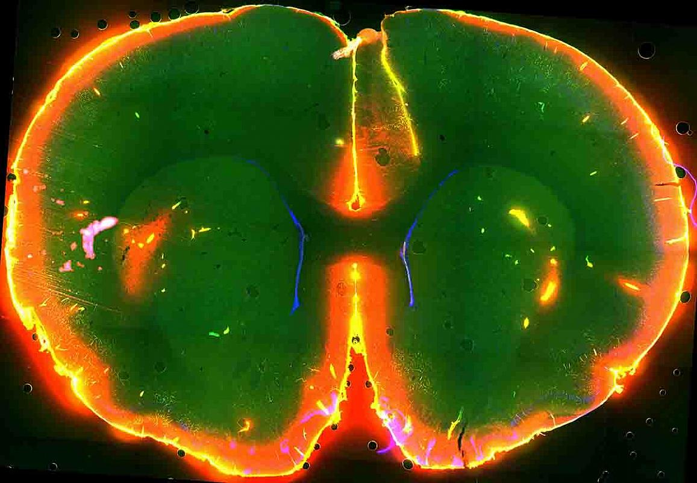

# [fit]Sleep

# [fit]Learning to Learn

---

>  Being awake creates **toxins** in the brain.

---

---

# While sleeping, the brain actually shrinks.

---

# Fluid can then flow past cells and wash out the toxins.

---

# Not getting enough sleep means you are operating using a brain with toxins.

---

# Getting too little sleep also has terrible long term effects.

---

# Long term effects of sleep deprivation

- Headaches
- Depression
- Heart Disease
- Diabetes
- Early death

---

Sleep does more than wash away toxins.

It is an important part of the memory and learning process

---

During sleep your brain tidies up ideas and concepts you’re thinking about and learning.

You can think of it as a mental defrag.

---

Less important parts of memory get erased

---

Which is a good thing.

---

Areas with important memories get strengthened.

---

Which is a very good thing.

---

During sleep your brain rehearses tougher parts of what you’re trying to learn.

---

This deepens and strengthens the neural pathways.

---

As a bonus, sleep puts you in the diffuse mode.

---

