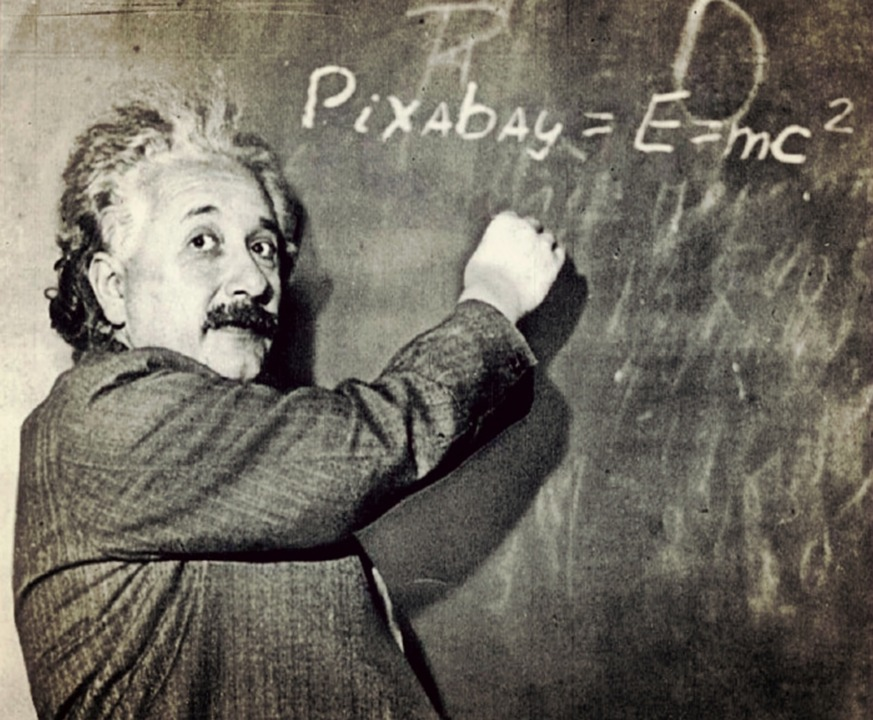
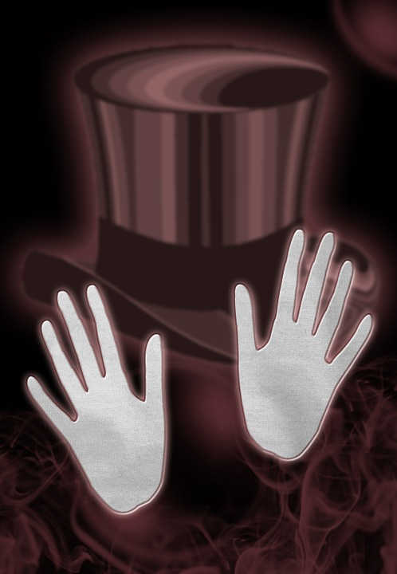

#Curse Of Knowledge

---

#Knowledge is a curse.

^The curse of knowledge is a cognitive bias that occurs with subject matter experts.  This especially happens with teachers where they have difficulty teaching students because they cannot forget "what they know" and put themselves in the place of students.

---

^We do not remember what it is like to not know what we are trying to teach.

---

#We
#Assume
#Clarity

^We assume that our lessons are clear.

---

#[fit] Lifting the curse