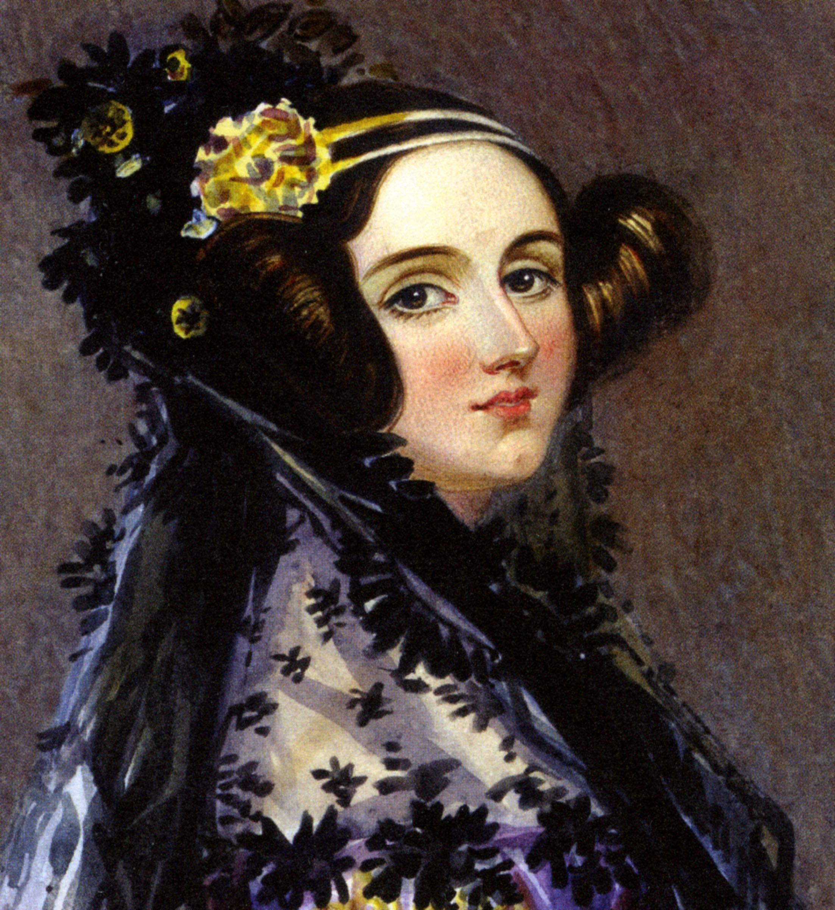

#[fit]Ada Lovelace
#Mathematician 
#and Writer

---

Known for her work on Charles Babbage's early mechanical general-purpose computer, the Analytical Engine.

---

Ada met Charles Babbage through their mutual friend, and her private tutor, Mary Somerville. 

---

Babbage had created the **Difference Engine** - a automatic mechanical calculator designed to tabulate polynomial functions.

---

Babbage was busy working on his next breakthrough - the **Analytical Engine** - a mechanical general purpose computer.

---

Ada was commissioned to translate an article in a Swiss Journal about the *Analytical Engine* and saw this as an opportunity.

---

In addition to translating, she added her own notes - making the article twice as long!

---

In one of the notes she describes an algorithm for the **Analytical Engine** to compute Bernoulli numbers. 

---

---

This was the first published algorithm ever specifically designed for implementation on a computer, for this reason Ada Lovelace is often cited as the worlds first computer programmer.

---

Ada imagined computers could do more than calculations - she believed they could be applied to any problem - even music composition.

---

Other interesting facts about Ada Lovelace.

---

.jpg)

Her mother was Anne Isabella Milbanke, Lady Wentworth - a Mathematician

---

.jpg)

Her father was Lord Byron - English poet.

---

The Department of Defense created a programming language named after her.

---

**Ada Lovelace Day** is celebrated in mid October.  

Its goal is to "... raise the profile of women in science, technology, engineering and maths," and to "create new role models for girls and women" in these fields.

---

My daughter's middle name is Ada.