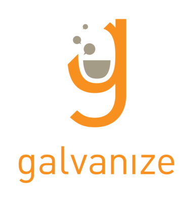

#[fit] First Day 
#[fit] Culture Talk

---

# Instruction

^ Instructors are not necessarily available to you nights, lunches, or weekends- respect our time.

^ The current instructors are not necessarily "your" instructors.

^ Galvanize is not a recruiting agency, you are not assured graduation, and you are not guaranteed a job.  Our job is to make sure you get out what you put in.

^ This is a culture of outcomes- "graduation" doesn't actually matter, only getting and keeping a job does.

^ Don't be a "bomb thrower" during lectures.

---

# Housekeeping

^ Attendance matters, and will be recorded often

^ Galvanize membership benefits- do's and don'ts

^ Be visible and network

^ Beware the free beer- don't be a drunk asshole

^ Be a good neighbor

^ Clean the classroom

^ Do dishes

^ Work the steam cleaner

^ No fucking with the thermostat- 72

---

# Personal Growth

^ The routines and rituals are part of the job.

^ Part of what you're doing is learning to learn.

^ This is really hard.

^ Don't quit easily

^ This will open more doors than just being a programmer

^ Don't say "I can't do this"

^ Don't say "I already know this"

^ Don't be terrified of error messages

^ Don't be afraid to search for answers for a longer than expected time

^ Keep your objective in mind.  Begin with the end in mind.

^ Some things have extremely high leverage- learning your text editor, environment, and dev tools, and increasing your typing speed are principle among them.

^ Learn time management- chunking, pomodoros, walking away from problems and coming back

^ Use the mastery tracker as a checklist to guide efforts

^ Interpersonal skills, project management, "thinking like a developer", and learning to learn are more important than any technology you'll learn here.

---

# Interactions

^ 33 in, 33 out- help each other out and get your classmates to the end of the program please

^ Culture of collaboration

^ You are here together

^ You are sources of info for each other

^ The best way to learn is to teach

^ Collaboration is a skill

^ If you want to go fast, go alone- if you want to go far, go together

^ Be mature and inclusive

^ Go to meetups, and do them together!

^ Respect each other's boundaries- there's a difference between asking for help, and giving unasked help

^ Cohort events aren't self-organizing. Someone will have to step up if you want a class blog, study group, etc. They are easy to do and have a high return of interest.

^ Dating within the cohort has extremely high potential for discomfort and drama

---

# Intention Setting

^ Note: This is an interactive exercise, after the students have had some expectations set, have them write a letter to their friends and family, along with a letter to themselves. It takes about 30 minutes to run.

---

^ Narrative

^ This course will be really hard. There will be lots of struggle. Cherish the times when stuff seems easy, because you're going to feel overwhelmed a lot of the time. When stuff is too easy for you, talk to us about it. You can always make your code better, so we'll push you as far as we think you can go. That's what this is for- be prepared to be outside your comfort zone. That's where growth happens.

---

# Friends and Family

^ If you're really ready to do this, you need to tell your friends and family that you're starting this very intense immersive program. Setting their expectations of you at this time will be really crucial, so that your support network is equipped to actually support you. To do this, we're going to write two letters.

---

# Yourself

---

# Anxiety

---

## MOST students in the program at one point or another deal with anxiety in one form or another

---

# Imposter syndrome

---

#Too Fast / Too Slow

^ People who feel like the program is moving "too slow" often feel like they came in with advanced skills and that they wish we were doing "DEF" now instead of "ABC". What they fail to realize is that the program pacing is intentional, there are MORE than enough challenges as the program marches forward, and at the end of the entire course we've never run out of work or learning opportunities for any student.

---

#Feeling like you're not going to get a job.

---

##Questioning the program, questioning 'code schools', questioning outcomes. (Plethora of doubts)

---

##Frustration with the blended learning model. Feeling like you're not getting your money's worth if you're not being lectured to every day, all day for six months.

---

##General visceral sense of unease that results from poor diet, lack of sleep, and lack of exercise. ( Not taking care of yourself).

---

## Different things work for different people, but most people respond very well to regular exercise, meditation, yoga, and/or other self-centering activities.

