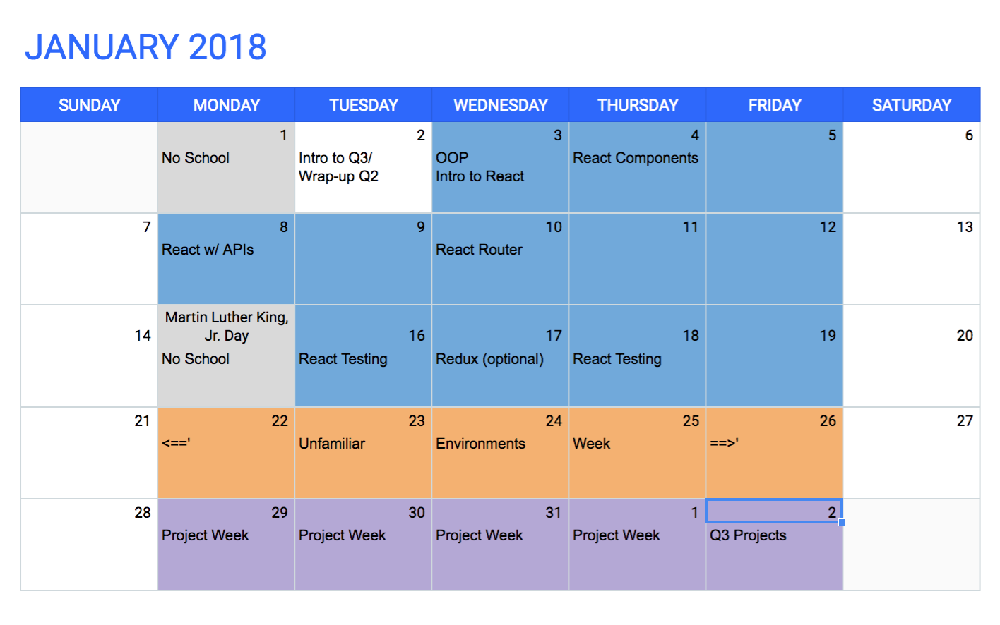
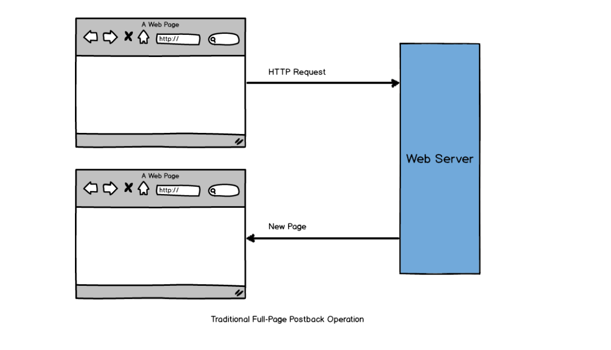
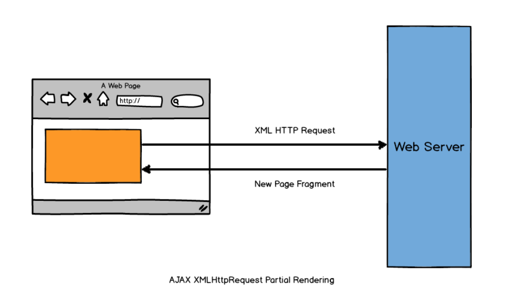
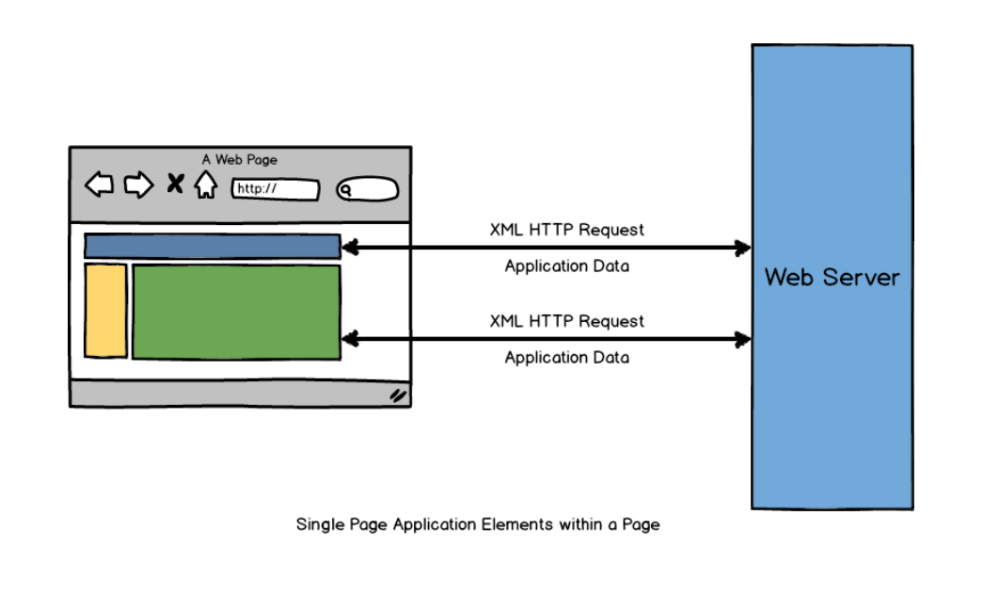

# Welcome to Q3!!

---

## But first...

# [fit] Let's Reflect on Q2

 What are you the most proud of?

^Revisit Vision Boards
^ Make list of things we learned

---

# Q2 Reflection continued

- Take a minute to think about all you learned
- Are you still unclear about anything?
- Have any questions?
- Is there anything you'd like to practice?

---

# [fit] Now...

---

## Let's get ready for Q3!

---

 
^ You have 3 weeks of React
^ 1 Week of unfamiliar Environment
^ Project Week

---

# What's New this quarter!

+ Fewer Lessons 
+ More Time for Career Services
+ Self Learning - GRIT
+ Single Page Applications

---

# [fit] Single Page Applications

---

###A Bit of History

1. Static Web Pages and Hyperlinks

^ Over the years, there have been several attempts to adapt the Web paradigm of static pages and links to application development. The Web approach of static pages and hyperlinks no longer suited web applications. Something had to be done.

---

### Various Application Development Models were born

+ Dynamically generated pages
+ Action based on MVC
+ MVC based on components
+ MVC enriched with AJAX

^Dynamically generated pages – Direct translation of the original model of pages and links, where pages are dynamically generated.

^Action based MVC – There is no longer a 1:1 mapping between URLs and the target pages. A controller decides what the next page is according to the operations that take place during page transition.

^MVC based on components – It simulates how desktop applications work. It is based on components and events. Any user action triggers the complete rebuild and reload of the page partially changing some parts, according to the action performed. The page and page transition is managed by components that know what changes take place based on the triggered event.

^MVC enriched with AJAX – With the help of JavaScript, this model allows partial changes in pages and obtains new data from the server without reloading. Millions of websites and web applications use AJAX to provide a better experience to end-users, thanks to more responsive user interfaces that partially avoid the annoying page reloads.

---

---

## Where We Stand Today

+ Server-templating model

^This model relies on an application server that processes data and sends it out as HTML, which, in the end, is rendered on the client. When the user clicks a button or a link on that page, a HTTP POST or GET operation is executed on the application server and a brand new HTML page is returned to the client browser to be rendered again.

^AJAX came into play to minimize page re-rendering by updating only the page area that changed. Despite this huge improvement, AJAX still does not stand as a complete solution.

---

## Cons

+ Bad user experience – Continuous page re-rendering has a negative impact on the 	user experience because network latency cannot be hidden from the user.
+ Poor performance – Unnecessary re-transmission of data over the wire occurs 		because the page completely reloads on each user interaction.
+ Lack of offline support – A web application ‘is alive’ as long as there is a 		server connectivity. If the server connectivity drops, the web application is 		practically worthless.

---

# Thusly, the rise of Single Page Applications

In a single-page application, all of the code needed is included in a single-page load. This includes all of the CSS, HTML, and JavaScript. The page does not reload, and it requires dynamic interaction with the Web server.

^ The term “single-page application” (or SPA) is usually used to describe applications that were built for the web. These applications are accessed via a web browser like other websites, but offer more dynamic interactions resembling native mobile and desktop apps.

---

---

### [fit] Front End Frameworks help to build SPAs.

^The most notable difference between a regular website and an SPA is the reduced amount of page refreshes. SPAs have a heavier usage of AJAX — a way to communicate with back-end servers without doing a full page refresh — to get data loaded into our application. As a result, the process of rendering pages happens mostly on the client-side.

---

# Advantages

1. Efficiency 

^ projects that used to take months and hundreds of lines of code now can be achieved much faster with well-structured prebuilt patterns and functions.

1. Safety

^ top javascript frameworks have firm security arrangements and are supported by large communities where members and users also act as testers.

1. Cost 

^ most frameworks are open source and free. Since they help programmers to build custom solutions __faster__, the ultimate price for web app will be lower.

^While building SPAs is trendy and considered a modern development practice, it’s important to be aware of its cons, including:

^Con: The browser does most of the heavy lifting, which means performance can be a problem — especially on less capable mobile devices.

^Con: Careful thought must be put into search engine optimization (SEO) so your content can be discoverable by search engines and social media websites that provide a link preview.

---

# Most Popular Frameworks in 2017 (in order of popularity)

- ReactJs
- Angular
- Vue (sort of)
- Others...Ember, Meteor, Backbone

---

###Resources:

+[CodeSchool: Single Page Applications](https://www.codeschool.com/beginners-guide-to-web-development/single-page-applications)
+[Intro to Single Page Applications](https://blog.4psa.com/an-intro-into-single-page-applications-spa/)
+[SPA vs MPA](https://medium.com/@NeotericEU/single-page-application-vs-multiple-page-application-2591588efe58)
+[Server-Side Rendering vs. Client-Side Rendering](https://medium.com/walmartlabs/the-benefits-of-server-side-rendering-over-client-side-rendering-5d07ff2cefe8)

