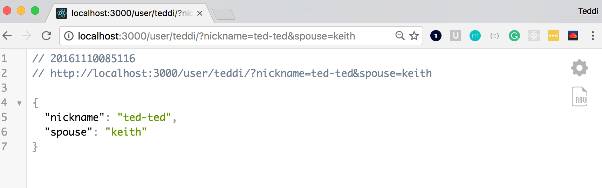

# Express - Getting Information from the Client

---

# Objectives

At the end of this lesson you should be able to:

- Explain two ways to get information from the client
- Identify a URL parameter on the client and the server
- Identify a Query parameter on the client and the server

---

# Why do we need information from the client?

---

# Client Side


---



^ Client Side, notice the parameters (url and query)
- ? denotes the beginning of the query parameters
- = indicates an assignment; anything to the left is the key, while the right represents the value
- & allows for the input of multiple parameters, separating each

---

# Server Side


---

# Where do we find what the client is telling us?

---

# URL Parameters - `req.params`


```javascript
app.get("/user/:name", function (req, res) {
  var name = req.params.name;
  res.send( "Hello, " + req.params.name );
});
```

^ The :name is the dynamic part of the route and will show up in the params object on the req object. In our example the :name was actually teddi
^ CFU - where do I find the url parameter and where on the client was this coming from?

---

# Query Parameters - `req.query`

```javascript
app.get("/", function (req, res) {
  var name = req.query;
  res.send("Query Received");
});
```

^ CFU - where do I find the query and where on the client was this coming from?

---

# Review Objectives

- Explain two ways to get information from the client
- Identify a URL parameter on the client and the server
- Identify a Query parameter on the client and the server

^ CFU What are two ways to get info from the client?
