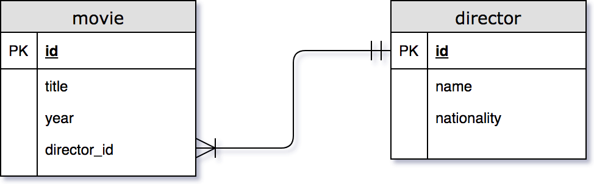

theme: Titillium, 1
autoscale: true
slidenumbers: true
<!-- @author: Pete Silva -->


## Full Stack CRUD REST, a guide
## Slack these out to begin

---


## We are going to build a simple full stack app tracking __directors__ and the __movies__ they have made.



---


## Phase 1: Express + Knex + DB Setup
## (30 min)

---


# GitHub
- Create a new repo "__movieapp__"
- Initialize w/ README
- Choose "__Add .gitignore: Node__"
- Choose "__Add a license: MIT License__"
- Once created, clone it down to your machine

---


# Express Generator

```
cd movieapp
express --ejs
npm install
```

---


# First commit

```
git status
git add .
git commit -m "first commit"
```

---


# Setup KNEX + Postgres
- Install knex globally, and also locally saving to package.json

```
npm install -g knex
npm install --save knex pg
```

---


# Create knexfile.js

```javascript
// knexfile.js: DB connection details
module.exports = {
  development: {
    client: 'pg',
    connection: 'postgres://localhost/movieappdb'
  }
}
```

---


# Create knex.js

```javascript
// knex.js: Intelligently choose environment
// require and setup knex module
const environment = process.env.NODE_ENV || 'development'
const knexConfig = require('./knexfile')[environment]
const knex = require('knex')(knexConfig)

module.exports = knex
```

---


# Create Knex migrations

`knex migrate:make movie`
`knex migrate:make director`

---


```javascript
// Movie migration file
exports.up = function(knex) {
  return knex.schema.createTable('movie', (table) => {
    table.increments();
    table.string('title');
    table.integer('year');
    table.integer('director_id').foreign('director_id').references('director.id');
    table.timestamps(true, true);
  });
};

exports.down = function(knex) {
  return knex.schema.dropTable('movie');
};
```

---


```javascript
// Director migration file
exports.up = function(knex) {
  return knex.schema.createTable('director', (table) => {
    table.increments();
    table.string('name');
    table.string('nationality');
    table.timestamps(true, true);
  });
};

exports.down = function(knex) {
  return knex.schema.dropTable('director');
};
```

---


# Run Knex migrations

`knex migrate:latest`

- Verify in psql CLI tool

```
git status
git add .
git commit -m "migrations created"
```

---


# Create Knex Seeds

`knex seed:make 01_movie`
`knex seed:make 02_director`

---


# Seed the DB

`knex seed:run`

- Verify in psql CLI tool

```
git status
git add .
git commit -m "seeds created"
```

---


Review Q+A: 15 min

---


## Phase 2: Basic Routes Functioning
## (20 min)

---


- Create new route file for each entity by duplicating an existing route file
  - movie
  - director
- Link up route files by adding app.use() lines to app.js

---


- For each route file, have 1 GET route respond w/ some success message
- npm start
- Test those GET routes
- Test 404 handling

---


- Stub out routes for GET/POST/PUT/DELETE in your route file with simple JSON replies
- Test them out with POSTman or HTTPie

```
git status
git add .
git commit -m "basic routes work"
```

---


Review Q+A: 15 min

---


## Phase 3: Routes Fully Working With DB
## (75 min)

---


- Make GET route read from DB
- Make POST route save to DB
- Make PUT route update DB
- Make DELETE route delete from DB
- Test them out with POSTman or HTTPie

```
git status
git add .
git commit -m "routes+db works"
```

---


Review Q+A: 30 min

---

## Phase 4: Build Frontend + Connect to Backend via AJAX
## (90 min)

---


- Create HTML/JS in ./public which will issue AJAX calls to our routes
- Write AJAX call to GET route, change the DOM
- Write AJAX call to POST route, change the DOM
- Write AJAX call to PUT route, change the DOM
- Write AJAX call to DELETE route, change the DOM

```
git status
git add .
git commit -m "front+back+db works!"
```
---


Review Q+A: 30 min
