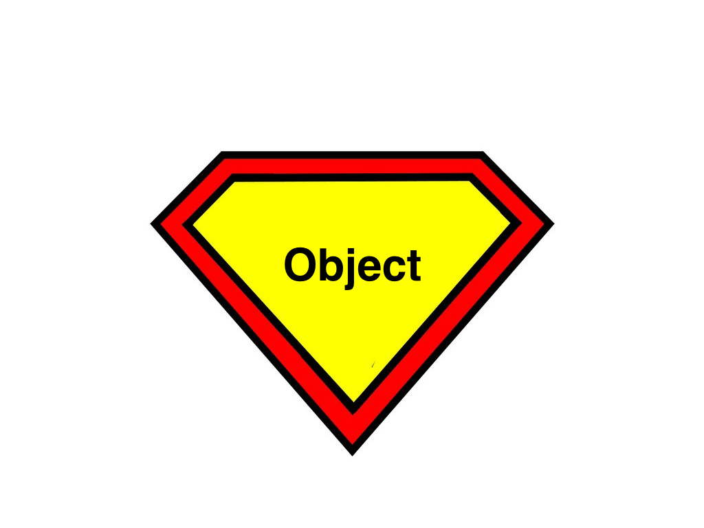
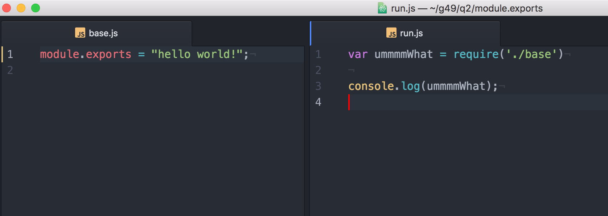

# Creating Your own Modules

---

# Objectives

- Explain what module.exports is
- Explain how to import and export code that you have written

---

# How is module.exports like Clark Kent?


---


---

## A lot of people don't recognize that it is just an object.


---

## module.exports



<a href="http://cliparts.co">ClipArts</a>


---

It's just an Object!

---

# How do you connect two files?

module.exports
+
require

---



---

# Set module.exports equal to an object

```js
module.exports = {
  name: "Asana",
  age:36,
  sayHello: function(){
    console.log("hello");
  }
};
```

---

# Set properties on the object

```js
module.exports.name = "Alisa";
module.exports.num = 15;
module.exports.list = [1,2,3,4];
module.exports.collection = {
  dog: "fido",
  cat: "willow",
  bird: "tweetie"

};

```

---

# You try it!

^https://github.com/gSchool/module.exports
