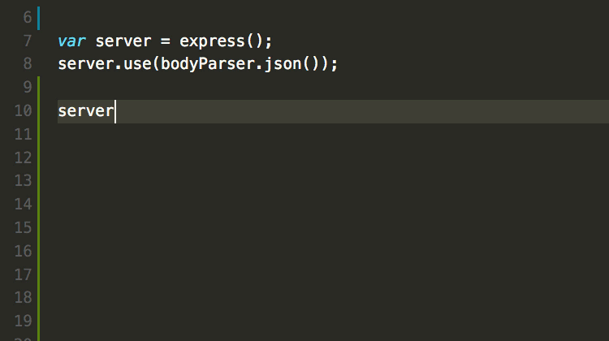

---

#What is Node.js?

---

# Simply put … Node.js is just another environment that can run JavaScript code.

---

## You already know JavaScript can be run inside the browser.

## Node.js allows JavaScript to be run on the server.

^ A runtime system is the environment that enables a program to be executed. When JavaScript was released in 1995, its only runtime system was inside a web browser. 

^ A runtime system is the environment that enables a program to be executed. When JavaScript was released in 1995, its only runtime system was inside a web browser. 

^ By using Node.js, developers can write JavaScript programs that run directly on an operating system like Linux, Mac OS X, and Windows.

---

> Why would we want to use JavaScript server side?

^ Use the same language on the server and the client!

^ Increase the amount of shared code.

^ An skilled client-side JavaScript developer can easily become a skilled server-side JavaScript developer.

^ True full-stack developers.

^ JavaScript is very popular.

---

#Where does Node fit in?

^ Node contains the same V8 JavaScript engine that Chrome uses.

^ Node uses the embedded V8 JavaScript engine to execute JavaScript - just like the browser does.

---

---

# JavaScript and the V8 engine are missing a lot of features necessary for a web server.

^ JavaScript in the web brower provides a lot of support for browser related tasks - like the DOM.

---

## Features like:
- File I/O.
- Database Access.
- Internet communication - accepting requests and sending responses.
- Gracefully dealing with work that takes a long time.
- Etc.

---

## Node.js extends the functionality of the V8 engine to provide these features.

---

---

# Node provides so much more ...

---

# Node Modules!

^ Modules are a way to package code to be used inside other applications.

---

# What’s better than re-using your own code?

^ Using other people's code!

^ A module is a collection of functions that can be imported into a file using the require() function. 

---

# Node itself is minimal … most functionality is provided through modules.

---

## The fs Module

---

# Sync vs Async?

^ Sync is blocking.  

^ Demo both.

---

- ~~File I/O.~~
- Database Access.
- Internet communication - accepting requests and sending responses.
- Gracefully dealing with work that takes a long time.
- ~~Better ways to organize code.~~
