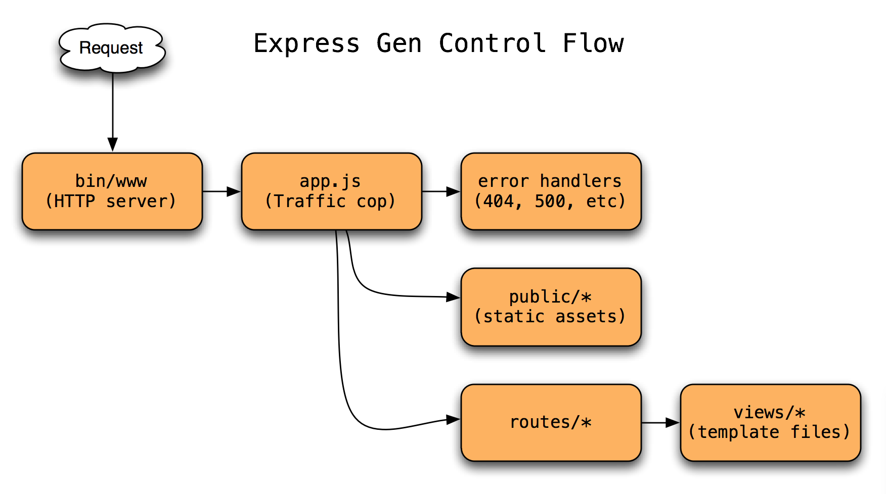

theme: Titillium, 1
autoscale: true
slidenumbers: true
<!-- @author: Pete Silva -->

## Express Generator


---

## Objectives


- Use Express generator tool to create a project skeleton
- Be able to explain the different pieces it generates for you
- Use Express router to setup RESTful routes
- Read URL & query string parameters in Express
- Use Express to respond with HTTP status codes + Content-Types

---


```bash
mkdir my-express-app
cd my-express-app
npm install express-generator -g

express -h
express --view=ejs

npm install
atom .
```
---


What's happening when we `npm install`?

Hint: See `package.json`

---


## WOW A PROJECT!

---


Explore what files it created for us and what do they do?

---


File|Function
---|---
bin/www|
node_modules/|
public/|
routes/|
views/|
app.js|
package.json|

---


File|Function
---|---
bin/www|initialize your web app
node_modules/|npm dependencies
public/|statically served assets (js, css, images)
routes/|the good stuff (process requests, furnish responses)
views/|the face (html + sugar)
app.js|the glue
package.json|npm manifest

---


## bin/www

- Set port number to listen upon
- Start up HTTP server listening on that port
- Pass control over to __app.js__

---


## app.js

- `require()` express, body-parser and other middleware that may be required
- `require()` your route files
- Setup your view (template) engine
- `app.use()`: Connect your middleware, static served assets (public) folder
- `app.use()`: Connect your route files
- Basic error handling for 404 and 500 errors
- Pass control to __route files__, __public (static assets)__, or __error handlers__

---


## routes/index.js

- Require the express router
- Your routes (relative to the app.use() in app.js that references this route file)

---


## Routes: The heart of your backend

- Review: A route responds to a request at some URL
- You can use body-parser and other methods to pull out data from the `req` object.
- Your route must terminate with a response of some kind

---


### Routes generally terminate in a few common ways

  - res.send(): End response with some body data
  - res.json(): End response with JSON body
  - res.end(): Simply end the response
  - res.render(): End response by passing to a template file

---



---


Let's write some RESTful routes together

- **I do:** a basic GET route
- **We do:** a basic POST route
- **You do:** a PUT route, and a DELETE route

---


Let's compare grabbing stuff from

URL params (/this/that/other/thing)
vs
Query string params (?name=mo&age=42)

---


T&T research:
How do we respond with a specific status code? How about a Content-Type?

Hint: DOCS!!

---

## Objectives


- Use Express generator tool to create a project skeleton
- Be able to explain the different pieces it generates for you
- Use Express router to setup RESTful routes
- Read URL & query string parameters in Express
- Use Express to respond with HTTP status codes + Content-Types
