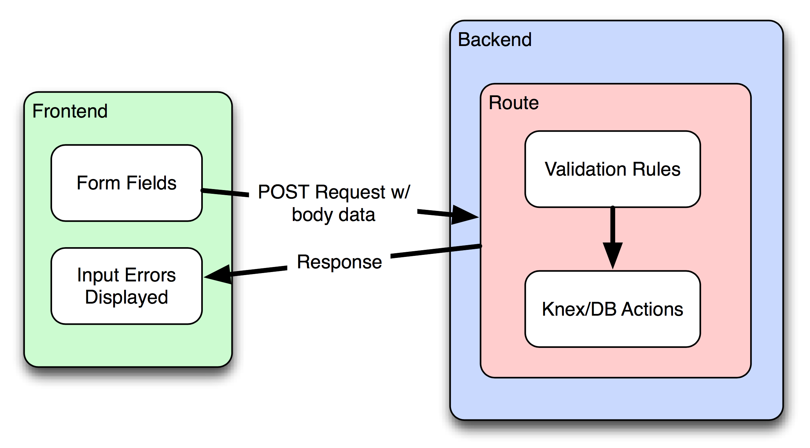

theme: Titillium, 1
autoscale: true
slidenumbers: true
<!-- @author: Pete Silva -->

# Server Side Validation
## aka the user can't be trusted

---

## Objective

- Explain what server-side validation is + why it's important
- Validate user input sent to an Express server.
- Display useful and readable error messages.

---

# Talk and Turn

## Where can we put input validation in a Full Stack App?

---

# Rule #1
# NEVER TRUST THE USER!!!!

---

### Users will abuse your site, either intentionally or by accident

- Blank fields
- Incorrect formats (dates, emails, phone numbers)
- Out of valid ranges
- Duplicate data
- Malicious attempts to mess your DB or hijack your site
- Intentional junk data to pollute your DB

---

---
# We call these __validation rules__

---
## Redundancy is required to protect all layers of your app

- Frontend (HTML5 form field constraints)
- Backend (In your routes)
- Data Model (In your migrations/schema)

---
## Backend

When a user submits any request data to a route, you can't just assume it's safe.

You need to check/cleanse the input before inserting into your DB.

User's can skip your UI altogether and issue mean requests to your backend with a variety of tools (HTTPie, cURL, etc.)

---

---

## Happy Happy, Joi Joi

We can use 2 NPM middleware packages to help us

__joi__

https://github.com/hapijs/joi

__express-validation__

https://www.npmjs.com/package/express-validation

---

# Pair Research (15 min)

## Joi
+ What is a Joi schema?
+ How do you verify numbers, emails and integers with Joi?
+ What does Joi.validate return?

## express-validation
+ How do you use a Joi validation schema in a route?
+ What are the steps to implement the express-validation middleware with Joi?

---

## Exercise (45 min)

Fork + Clone

[https://github.com/gSchool/serverSideValidation](https://github.com/gSchool/serverSideValidation)

+ Add validations for the registering user to the POST route
+ Display error messages if the user already exists
+ Add one additional field and validate it (e.g. Age)

