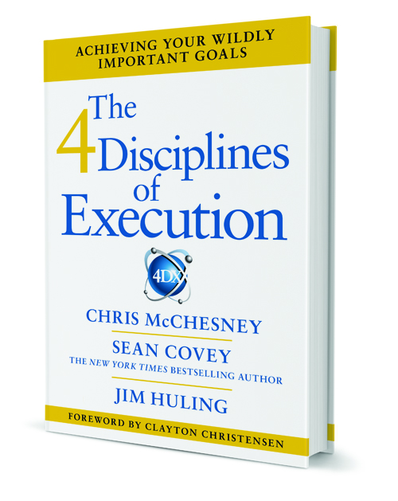
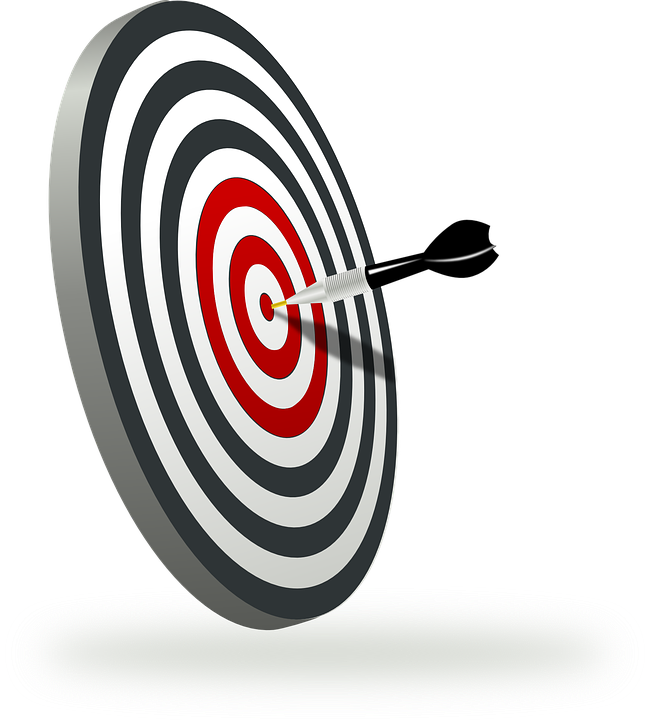
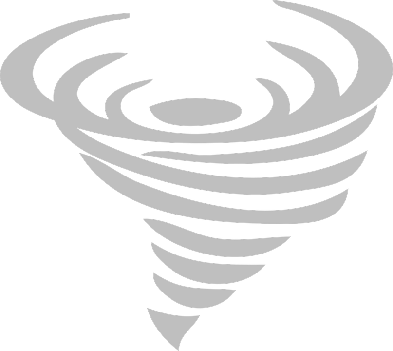
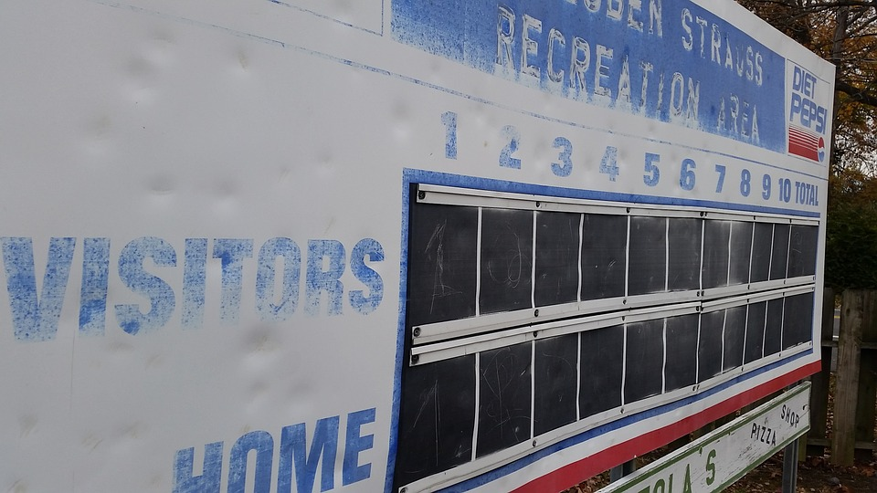
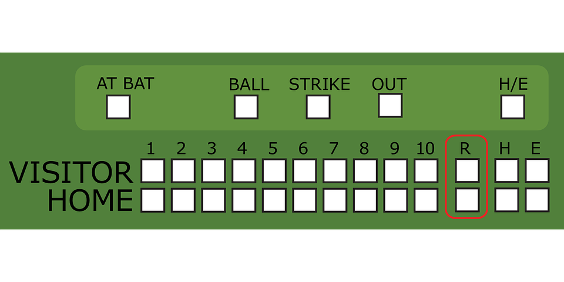
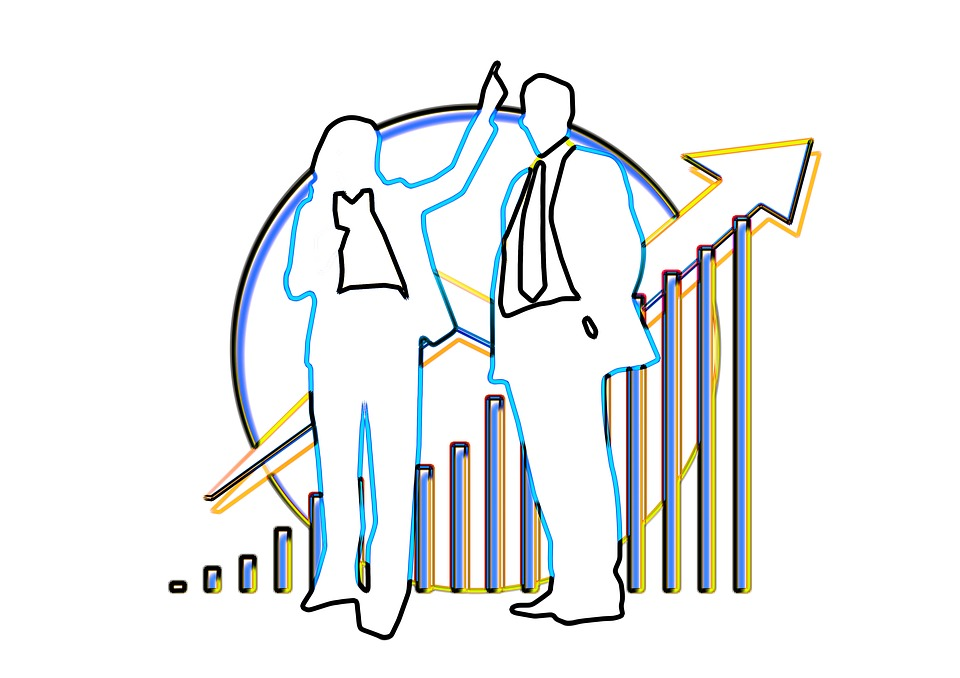
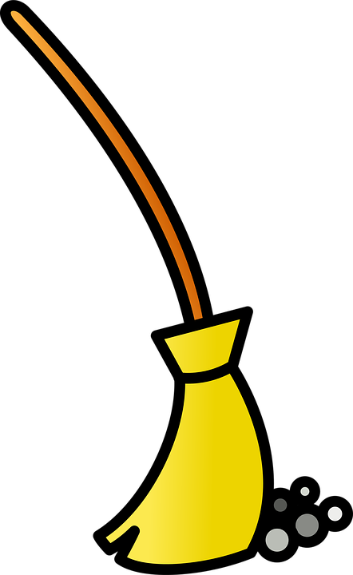

#4DX

---

#Objectives

- Describe the 4 Disciplines of Execution.
- Explain why the 4 Disciplines work?

---

#[fit]The 4 Disciplines are a process.

---

#[fit]The Whirlwind

---

#[fit]whirl·wind **noun** Your Job

---

##The massive amount of energy just to keep going.

---

#[fit]What robs you of focus to move forward.

---

#[fit]Discipline 1
#[fit]Wildy Important Goals (WIGs)

---

### Focus your effort on one or two goals that will have the most impact, rather than giving minimal effort towards all the goals.

---

##A wildly important goal (WIG) is a goal that can make all the difference.

---

## Don't ask 
> "What's most important?"

##Ask 
> If everything else remained the same, what is the one area where change would have the greatest impact?

^Question: The summary suggests that the WIG can come from inside the whirlwind?

---

#[fit]Rules

---

##*No team focuses on more than* two WIGs *at the same time.*

---

##*Lower level WIGs should help* achieve *higher level WIGs.*

---

##*Leaders can* veto*, but not* dictate.

---

##All WIGs must have a finish line.

###*In the form of from X to Y by when.*

---

#*The WIG must be* achievable*.*

---

#[fit]Discipline 2
#[fit]Lead Measures

---

##*A* lag measure *tells you if you've achieved a goal*.

---

##*A* lead measure *tells you if you are likely to achieve the goal.*

---

### A lead measure is predictive.
### A lead measure is influenceable.
### The more you act on the lead measure, the more likely you are to achieve the goal.

---

##*This is the single most* difficult *aspect of 4DX.*

---

#[fit]Discipline 3
#[fit]Scorecard

---

##[fit]People will disengage and focus on the whirlwind,
##[fit]unless they know the score.

---

#*The score is what impact the* process *is having*.

---

###Knowing the impact also allows the team to adjust when its not working.

---

##4 Questions to ask

### Is it Simple?

### Can I see it easily?

### Does it show lead and lag measures?

### Can I tell at a glance if we are successful?

---

##Showing results will engage the team.

---

#[fit]Discipline 4
#[fit]Cadence of Accountability

---

###The team must meet at least weekly in a WIG session.

---

##The meeting lasts no longer than 20-30 minutes.

---

##Three Part Agenda

---

Report on commitments.

---

##Review the scorebard.  Learn from Successes and Failures.

---

##Clear the path and plan new commitments.

---

##"What are the one or two most important things I can do this week to impact the lead measures?"

---

#Two rules for commitments

1.  The commitment must represent a specific and measurable.
2.  The commitment must influence the lead measure.

---

###You want each team member to take ownership over the commitments they make.

---

##Clear the path

---

##This only works if there is time for your commitments.

---

###If you have time, ask

###"What can I do to clear the path for you?"
