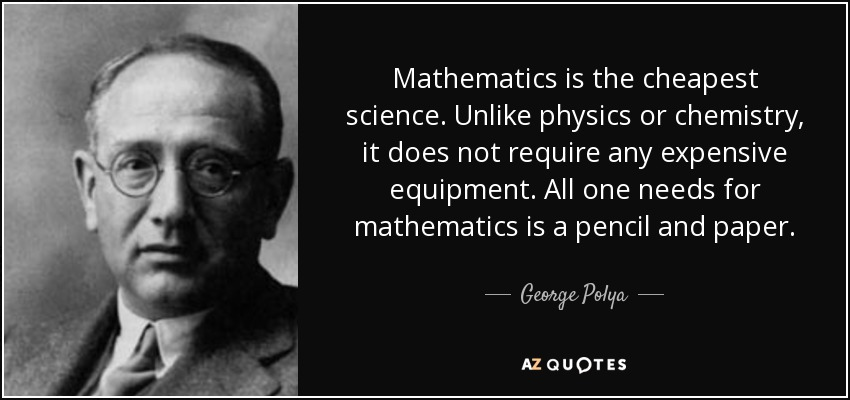

# Polya's Technique

---

# Objectives
- Name the four steps of Polya's Technique
- Apply Polya's Technique to Novel Problems
- Use "0, 1, Many, Crazy" to determine input/output test cases

---

# Polya's Problem Solving Framework Steps

1. Understand the Problem
1. Devise a Plan
1. Carry Out the Plan
1. Look Back

---




---

# ALL OF PROGRAMMING...

INPUT -> OUTPUT

---

# STEP ONE: Understand the Problem
  * Identify Inputs and Outputs
  * Ask "What if" Questions

---

## Test Cases "0, 1, Many, Crazy"

Input: Array of numbers

```
[1, 2, 3]
```

Outputs:

```
0 -> []  but also null, undefined
1 -> [1], [3.141592]
many -> [1, 2, 3]
crazy -> [NaN], {}, ['one', 'two', Infinity, true, [1,2,3]]
```

---

# STEP TWO: Devise a Plan
  * Come up with more than one plan
  * Choose a solution based on:
    - Your Ability
    - Code's Performance
    - Code Maintainability / Readability

---

# STEP THREE: Carry Out the Plan
  * Quickly dispense with boilerplate code
  * Write code 'outside in' ("sandwich code")

---

# STEP FOUR: Look Back
  * Ensure the correctness of your solution (and keep working until it's correct)
  * Once it's correct, decide where you want to go:
    - You could refactor https://github.com/gSchool/javascript-curriculum/blob/master/Refactoring.md
    - You could burn-and-build (delete and rewrite)
    - You could write a real test suite

---

Write a function that takes a camelCase string and returns

```
SCREAMING_SNAKE_CASE
```
