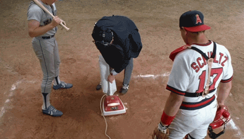

# [fit]Clean 

# [fit]Code

---

```javascript
var x,y,z;

x = 5;

if (x === 5) {
  	console.log(y);
} else { return false; }
function Person (firstname, lastname, age, weight, isAlive, hairColor, height, city, state, country) {
    //Create a Person object
}
```

---


---

> **“Programming is the art of telling another human what one wants the computer to do.”**
>
> — Donald Knuth

---


---

# **Clean Code Helps You and Teammates:**

- Read code
- Change code
- Keep the code working
- Reduce the cost of maintenance
- Fix bugs
- Reduce the time to modify code
- Enjoy programming more
- Make life easier

---


```javascript
function Person (firstname, lastname, age, weight, isAlive, hairColor, height, city, state, country) {
    //Create a Person object
}
```

---


# Many Parameters

---


```javascript
// Can anyone remember the parameters and order of the many version?
function Person (spec) {
    //Create a Person object
    this.firstname = spec.firstname;
    this.isAlive = spec.isAlive;
}
```


------

```javascript
function checkSystem (isReady, message) {var output; if (isReady) {
		output = 'all systems go! ' + message;
} else {
output = 'I can\'t let you do that.'}return output;}
```

---


# Inconsistant Indentation

------

```javascript
function checkSystem (isReady, message) {
	var output;
	if (isReady) {
		output = 'all systems go! ' + message;
	} else {
		output = 'I can\'t let you do that.';
	}
	return output;
}
```


------

```javascript
function calculatePrice (retailPrice) {
    return retailPrice + retailPrice * 0.08 + retailPrice * 0.02;
}
```

------


# Magic Numbers

---

```javascript
function calculatePrice (retailPrice) {
    var salesTax = 0.08;
    var viceTax = 0.02; 
    return retailPrice + retailPrice * salesTax + retailPrice * viceTax;
}
```

---

```javascript
function sendMessage() {
    var message = $("#messageBox").val();
    var user = $("#user").val();
    var time = new Date();
    emitMessage({ message: message, user: user });
}
// Did the developer intentionally not use “time”,
// or did he accidentally leave it out and it is a bug?
```

---


# Unused Variables

---

```javascript
function sendMessage() {
    var message = $("#messageBox").val();
    var user = $("#user").val();
    emitMessage({ message: message, user: user });
}
```

---

```javascript
function sendMessage() {
    var message = $("#messageBox").val();
    if (message.length <= 3) {
        throw new Error('message not long enough');
    }
    var user = $("#user").val();
    var message = { message: message, user: user };
    var server = getServer();
    server.connect();
    var result = server.send(message);
    if (!result.success) {
        throw new Error(result.message);
    }
}
```

---


# Long Functions

---

```javascript
function sendMessage() {
    //handle errors in functions and handle complexity
    var message = getMessageObject();
    server.sendMessage(message);
}
```

---

```javascript
function checkoutBook() {
    var book = getBook(), user = getUser(), booksOut = user.getBooksOut(), name = user.name;
    if (booksOut.length >= 3) {
        throw new Error('Too many books checked out', user);
    }
    user.checkout(book);
    console.log('Thanks for using the library ' + name);
}
```

---


# Long Lines

---

```javascript
function checkoutBook() {
    var book = getBook();
    var user = getUser();
    var booksOut = user.getBooksOut();
    if (booksOut.length >= 3) {
        throw new Error('Too many books checked out', user);
    }
    user.checkout(book);
    console.log('Thanks for using the library ' + user.name);
}
```

---

```javascript
function p(b, e) {
    if (e === undefined) {
        e = 0;
    }
    var r = 1;
    for (var c = 0; c < e; c++) {
        r *= b;
    }
    return r;
}
```

---


# [fit] Undescriptive

# Names

---

```javascript
function power(base, exponent) {
    if (exponent === undefined) {
        exponent = 0;
    }
    var result = 1;
    for (var count = 0; count < exponent; count++) {
        result *= base;
    }
    return result;
}
```

---


```javascript
$('div').click(function () {})
$('div').css('background-color', 'red')
$('div').hide()
```

---


# Bad jQuery Selectors

---

```javascript
var $divs = $('div')
$divs.click(function () {})
$divs.css('background-color', 'red')
$divs.hide()
```

---

# Not Just Javascript


---

```css
div table tr td ul li #con, div div div div span #con {color:red;background-color:blue;margin:0 0 0 10px;
padding: 0 10px 10px 100px;}
```

---


# Bad CSS

----

```css
#con {
  color: red;
  background-color: blue;
  margin: 0 0 0 10px;
  padding: 0 10px 10px 100px;
}
```

# 

---

```html
<body><div><div><span>
puppies</span>
</div>
              </div><div>
                    kittens
</div></body>
```

---


# Bad HTML

---

```html
<body>
  <div>
    <div>
      <span>puppies</span>
    </div>
  </div>
  <div>kittens</div>
</body>
```

