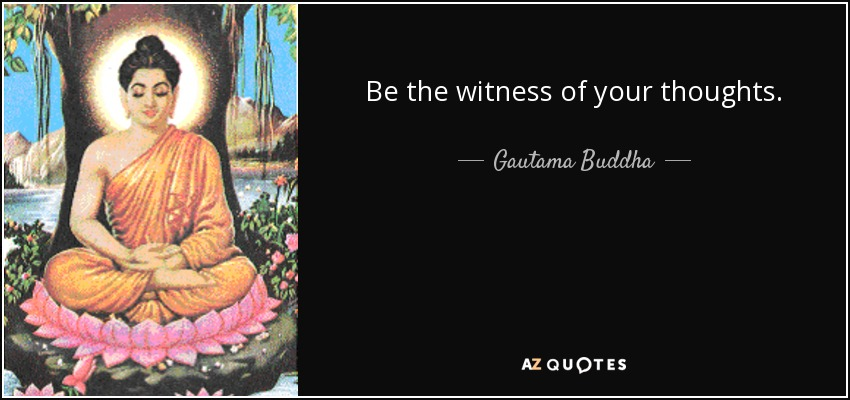
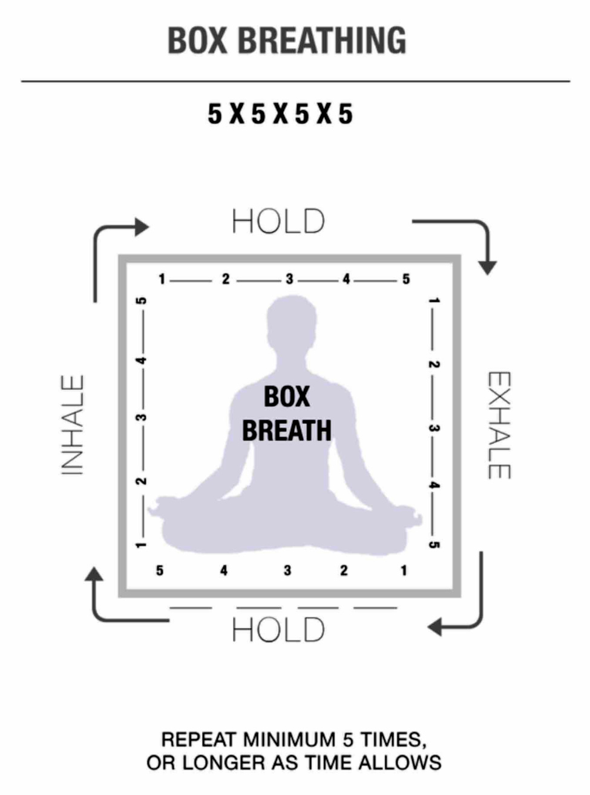

# GRIT

---

# OBJECTIVES:
- Describe the 20X principle
- Name and apply the 4 Steps of Mental Toughness

---

## Right down one negative thought you have had about yourself since joining Galvanize.

---

# "I don’t know how to swim"

^ Navy Seals study, what are the qualities of the people who pass.  They have...
^
^ GRIT

---

## Do 1 push ups (on knees is OK)

Write down how many pushups you could do in the next hour

---

## An entirely possible answer...

# 1,000!!!

---

# 20X

We are capable of 20 times more than where our minds initially stops us.  That is true for the students and true for us.  That is true in most aspects of our lives.

---

# Talk and Turn

## How do you develop GRIT while in a program like Galvanize?

---

---

- Practice being uncomfortable by putting yourself in uncomfortable positions
- Use the Four Steps of Mental Toughness to push yourself past the sucky parts

---

The Four Steps of Mental Toughness
1. Witness your thoughts
2. Breath Control
3. Visualization
4. Positive Self Talk

---

# 1. Witness - Recognize Negative Self Talk

---

# 2. Breath Control - 2 deep breathes

^ practice breathing when you're not in stressful situations

---

## Use Box breathing to practice your breath control, use 2 deep breathes when you are in a stressful situation

---

# 3. Visualization
- Win in your mind
- What is the Next Action to do
- Pick a __micro goal__, do it, then pick another

---

# 4. Positive Mental Attitude

It's essential to have a silly mantra...

---

# "Looking Good. Feeling Good. Oughta be in Hollywood!"

---

"Easy Day. Piece of Cake.  You got this!"

---

# CFU

- What is the 20x principle?
- What are the four steps of mental toughness?

---

# FINAL THOUGHTS

- You have to pratice these techniques in order to use them duress, however, even one piece of them will help you!

- Practicing in one realm will transfer to another...

physical | mental | emotional | spiritual

---

__Get out of your comfort zone and practice the four steps___

- Cold Showers - work up to 1-2 minutes, try not to hate it
- Learn Something new outside your normal domains...Take Swing Dance Lessons, Learn a language, etc.
- Sign up for a race 2x distance you have done before 5K -> 10K, 1/2 Marathon -> Marathon
- Public Speaking ... Meetups, Open Mike, Lunch and Learn for your campus
- Intro to Cross Fit

---

# Resources

- Book: "Unbeatable Mind" by Mark Divine
- Witness: Head Space App - https://www.headspace.com
- Breathing: Box Breathing - https://www.youtube.com/watch?v=GZzhk9jEkkI
- Visualization: practice OODA Loop or PROP depending on how dire the circumstance
- Positive Attitude: Pick a silly mantra, practice it often

