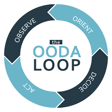

# INTRO

The Galvanize Immersive programs are hard!  Sometimes people want to quit.  If you don’t know why you are there then your chances of quitting are much higher.  Come to this session to learn a four step strategy you can share with students to get through the toughest obstacles.  AND…teaching the immersive is HARD for the teacher as well, so this strategy is essential (IMO) for the instructor as well.  So, we will focus on the teacher side of the equation including 2 tools for evaluating where you are and reviewing your purpose.

---

# PREWORK
- At the end of your normal shower take a 10-20 second shower on full cold.  Note your internal thought process/reaction to this.
- Spend 15-20 minutes creating a brief personal mission statement for your career.  What is your “why?”  Your mission statement is the unique intersection of what you love to do, what you value and what you can give to the world.  Your personal mission statement is different than Galvanize’s mission statement.

---

# GRIT

---

Thinking back to the cold shower experiment...How did you react?

---

OBJECTIVES:
- Describe the 20X principle
- Name and apply the 4 Steps of Mental Toughness
- Create a personal mission statement
- Use PROP to help assess your priorities
- Name the parts of the OODA Loop

---

## In the comments...
Right down one negative thought you have had about yourself since joining Galvanize.

---

# I don’t know how to swim

^ Navy Seals study, what are the qualities of the people who pass.  They have...
^
^ GRIT

---

## Do 10 push ups (on knees is OK)

## then in the comments...

Write down how many pushups you could do in the next hour

---

# 1,000

---

# 20X

We are capable of 20 times more than where our minds initially stops us.  That is true for the students and true for us.  That is true in most aspects of our lives.

---

# How do you develop GRIT?
- Practice being  uncomfortable by putting yourself in uncomfortable positions
- Use the Four Steps of Mental Toughness to push yourself past the sucky parts

^ Everyone has a plan until they're punched in the face.

---

The Four Steps of Mental Toughness aka "GRIT"
- Witness
- Breath Control
- Visualization
- Positive Mental Attitude

---

# 1. Witness - Recognize Negative Self Talk

---

# 2. Breath Control - 2 deep breathes

^ practice breathing when you're not in stressful situations

---
## Use Box breathing to practice your breath control, use 2 deep breathes when you are in a stressful situation

---

# 3. Visualization
- Win in your mind
- Pick a micro goal

---

# 4. Positive Mental Attitude

- It helps to have a silly mantra!

> "Looking Good. Feeling Good. Oughta be in Hollywood!"

> "Easy Day. Piece of Cake.  You got this!"

---

# What is your Why?

Your mission statement is the unique intersection of what you love to do, what you value and what you can give to the world.

- Take 5 minutes, share your mission statement in the comments as it is ready.

---

# P.R.O.P. Rapid Planning Tool

- __P__riorities
- __R__ealities
- __O__ptions
- __P__lan

---

# P.R.O.P.

- __P__riorities - What's your ONE THING that you need to get done today?
- __R__ealities - What constraints do you have?
- __O__ptions - What are your options?
- __P__lan - Pick a plan, get after it

---

# OODA Loop - Rapid Assessment Tool

---

# CFU

- What is the 20x principle
- What are some techniques you can use in stressful situations
- What are the four steps of mental toughness?

---

# FINAL THOUGHT

- You have to pratice these techniques in order to use them duress, however, even one piece of them will help you!

---

# Resources

- Book: "Unbeatable Mind" by Mark Divine
- Witness: Head Space App - https://www.headspace.com
- Breathing: Box Breathing - https://www.youtube.com/watch?v=GZzhk9jEkkI
- Visualization: practice OODA Loop or PROP depending on how dire the circumstance
- Positive Attitude: Pick a silly mantra, practice it often

---

## Suggestions for Practicing
__Anything that takes you out of your comfort zone physically, mentally or emotionally are all opportunities to practice the GRIT method__

- Cold Showers - work up to 60 seconds, try not to hate it
- Learn Something new outside your normal domains...Take Swing Dance Lessons, Learn a language, etc.
- Sign up for a race 2x distance you have done before 5K -> 10K, 1/2 Marathon -> Marathon
- Public Speaking (outside your classroom)...Meetups, Open Mike, Lunch and Learn for your campus
- Intro to Cross Fit
