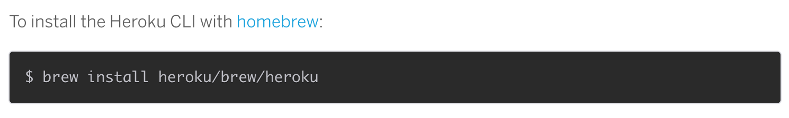
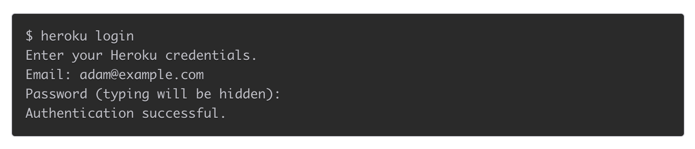
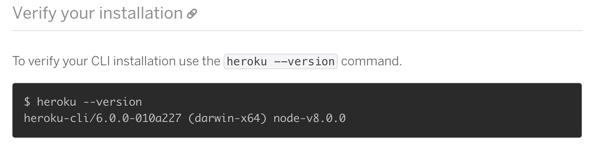

---

# Objectives

- Understand what Heroku is
- Install Heroku on the Command Line
- Be able to create a Heroku Application via Command Line
- Be able to push server-side application to Heroku

———

# What is Heroku?

^Heroku is cloud application platform. It can host your server-side application. Heroku is a polyglot, it can speak many languages. One of the many languages is speaks is Node.JS

^Heroku is like surge but for full stack apps instead of just static webpages. It can be set up to include a database, backend and front end.

^Heroku is an easy way to deploy your application publicly with little configuration with servers and such. And it’s free! Sort of…

^Unlike AWS, Cloud Foundry, Digital Ocean, or Microsoft Azure. The set up is minimal and the cost is pretty cheap. I encourage you to look into these other platforms because on larger scale applications some of these choices may be a better fit

———

# Heroku

- Polyglot
- Builds app with little configuration
- works with git
- Free! (ish..)

—

# Some Vocab

- Heroku - cloud application platform
- Build - The action of launching an application
- Package.json - the build instructions including dependencies that need to be installed for application to work
- Procfile - list process types. Named commands that you may want executed
- Slug - bundle of your source, fetched dependencies, the language runtime, and compiled/generated output of the build system - ready for execution.

———
 
# More Vocab
- Buildpacks - lie behind the slug compilation process. Buildpacks take your application, its dependencies, and the language runtime, and produce slugs.
- Config vars - customizable configuration data that can be changed independently of your source code. The configuration is expose to a running application via environment variables.
- Add-ons - third party, specialized, value-added cloud services that can be easily attached to an application, extending its functionality

—

# Last one..
-Dynos - During are isolated, virtualized Unix containers, that provide the environment required to run an application.

—-

# Cool, that was a lot of vocab! But what does that really mean and how is this relevant?
^ Let’s go through this step by step!

———

1. The source code for your application (your application’s code)
1.  Dependency file depending on the language you are using (as mentioned above) (Package.json)
1.  File informing the platform as to which parts of your application are runnable (Procfile)
**Caveat:** Heroku will automatically default your application to a web dyno. Which would be the only thing you would need to specify in your app using Node.js. So You don’t actually need one at this point in time!

^ Questions?

—--

##Together Let’s Do This!

—
 
# Now let’s go to heroku.com
## And Get Ready To Create A Checklist

---

# Objectives

- Understand what Heroku is
- Install Heroku on the Command Line
- Be able to create a Heroku Application via Command Line
- Be able to push server-side application to Heroku
