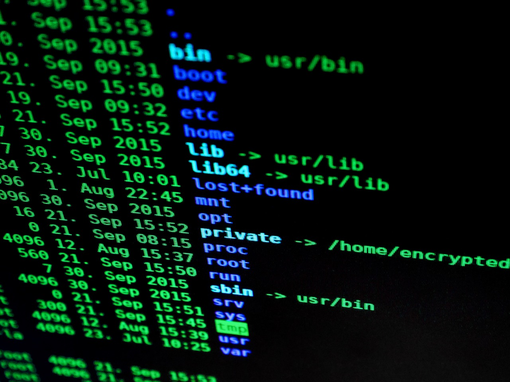
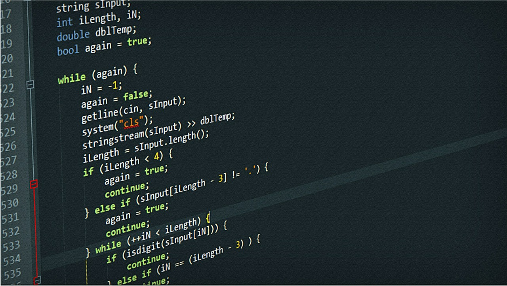

# Introduction to the Command Line

---

# "Mastery of the command line will make you a faster and more powerful developer"

---

#[fit]Unix Philosophy

---

#[fit]Chaining Commands

---

# Scripting

---

# Resources

- Unix Man Pages
- explainshell.com
- Learn the command line the hard way.
- Terminal Cheats.

---

# Work through the exercise.

## Why?

- Blended Learning
- Better questions
- Individualized help

--- 

#[fit] Questions?

---

#[fit] Assignment(s)
