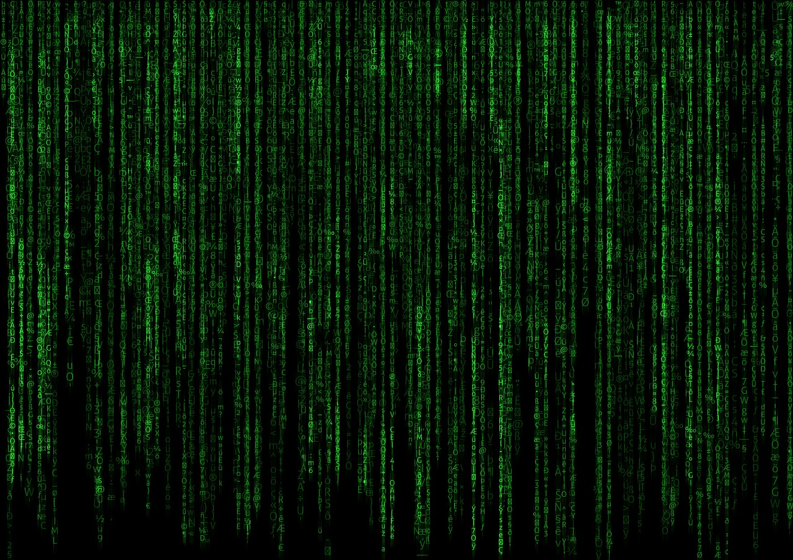
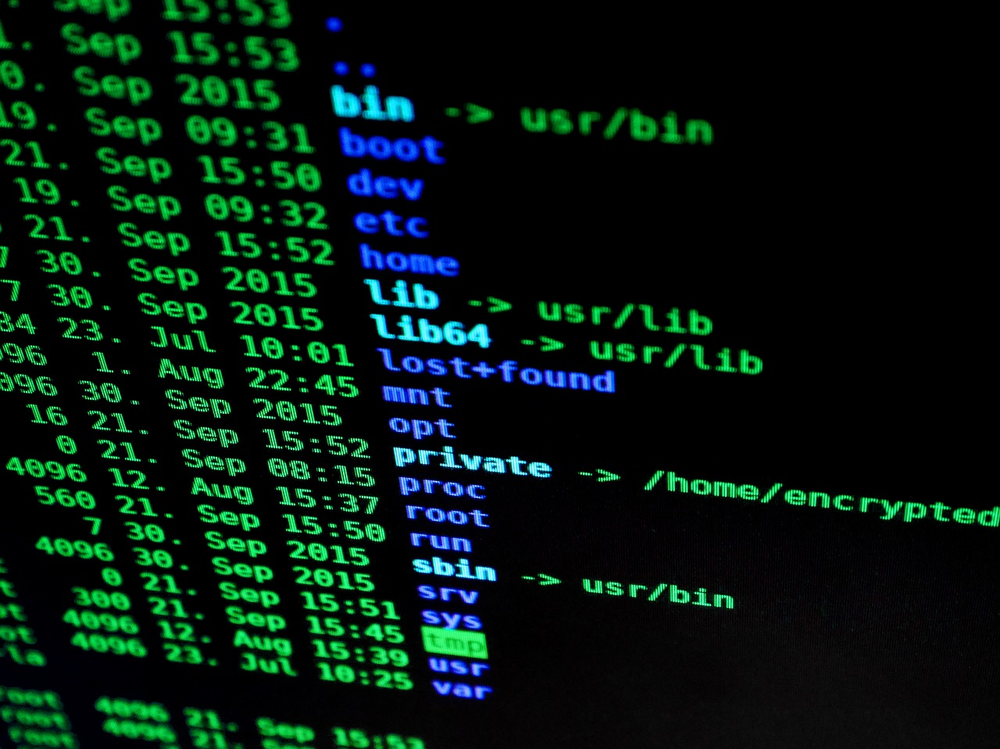

# Introduction to the Command Line

---

### Objectives

##
- Know why the command line is a useful tool
- Understand how to read a man page
- Navigate the files system using cd, ls and pwd
- Create, move and remove files directores using touch, mv and rm, mkdir, rmdir
- Copy files from one directory to another using cp
- Pipe commands together
- Search files using grep

---


# "Mastery of the command line will make you a faster and more powerful developer"

---


#[fit]Unix Philosophy

## “Do one thing and do it well.”
---


#[fit]Chaining Commands

---



# Scripting

---

# Finding Help

```
man man
man ls
```

---

# File System Commands

```
cd ~
ls
ls -a
ls -l
ls -R
```

### Note: there are often more flags than you will have use for

```
pwd
```

```
cd /
cd ~
cd ../..
pwd
```

---

# File Manipulation

## create and view a file

```
touch notes.txt
echo "Mochi" >> notes.txt
echo "Bootsy" >> notes.txt
ls -l notes.txt
cat notes.txt
```

---

## rename a file

```
mv notes.txt cats.txt
cat cats.txt
```

## delete a file

```
rm cats.txt
```

---

# Directory manipulation

## create and remove a directory
```
cd ~
mkdir test
ls -l ~
rmdir test
```

## get organized!
```
mkdir -p ~/workspace/q1
```

---

# Copying files

```
mkdir cats
mkdir pets
touch cats/meow.txt
cp -R cats/* pets/.
ls -laR pets
```

---

# Piping Commands

```
history
history | tail
history > history.txt
```

---

# Search

```
grep ls history.txt
grep -A1 ls history.txt
grep -B1 ls history.txt
grep -C1 ls history.txt
```

---

# Word of caution

## The command line is exteremely powerful.  There are some command that can ruin your computer or your day.  Example (Do not run these commands)...

```
rm -rf /   <- This will ruin your day
```

## Which includes making a typo!

```
rm -rf / Users/Craig/test <- note space after / DOH!
```

---

# Other favorite commands

```
clear
cal
ssh
find
chmod
whoam
groups
sudo
vim
open
top
ps
```

---


# Resources

- Unix Man Pages
- explainshell.com
- Learn the command line the hard way.
- OS X Terminal Cheatsheets

