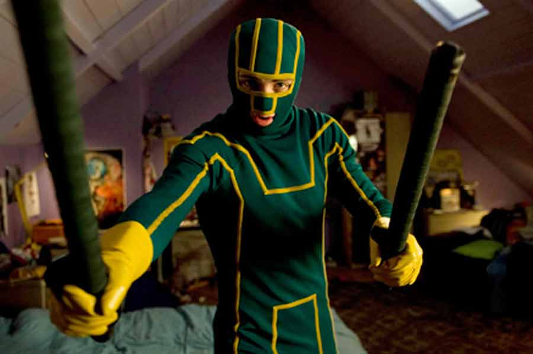

# How to have a Kickass Team

---

# A great team is about the collective mindset of the individuals on the team.

---

## Understand the mission
- You are responsible for making it clear
- You must ask questions if the "why" or the "what" are not clear

---

## Tools
- Determine the Relationship (set expectations)
- Plan then code
- Wireframe
- Clear User Stories - As a (blank), I want to (blank) so I can (blank)
- Work from a Prioritized To Do list

---

If you don't understand or believe in the decisions coming from your team, it is up to you to ask questions until you understand what the team is doing.

---

## Communicate often and early

---

## Tools
- Stand Ups in morning and after lunch
- Track your progress in a shared location (Trello, Pivotal Tracker, etc.)

---

## Take ownership of the success of the whole project

Team -> Team Mate -> Self

__not__

Self -> Team Mate -> Team

---

# Tools
- Ask yourself: "What can I do to make this better?"
- Elect a Team Leader as necessary

---

## Make iterative decisions

---

# Tools
- Kanban - Complete WIPS before new tasks
- Sprint Iterations
- Retro if you need to
- OODA Loop - OBSERVE, ORIENT, DECIDE, ACT

---

## Checklists - don't miss steps

---

## Tools
Checklist Manifesto

---

## Working software is the primary measure of progress.

---

## Tools
- Minimal Viable Product (MVP)
- Test Driven Development (TDD)
- Deploy every day including the first day

---

## As a team member or leader be...

Ready to Lead
Ready to Follow
Never Quit

---

## One last thing...
If you're not having fun, you're doing it wrong

- Team Mascot
- Team Bonding!
- Team Motto
- Team Flag
- Team Spirit