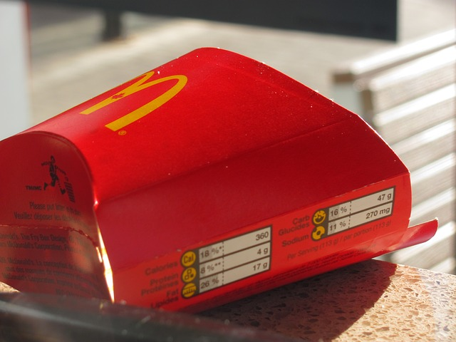
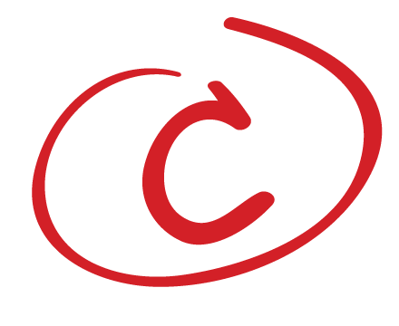
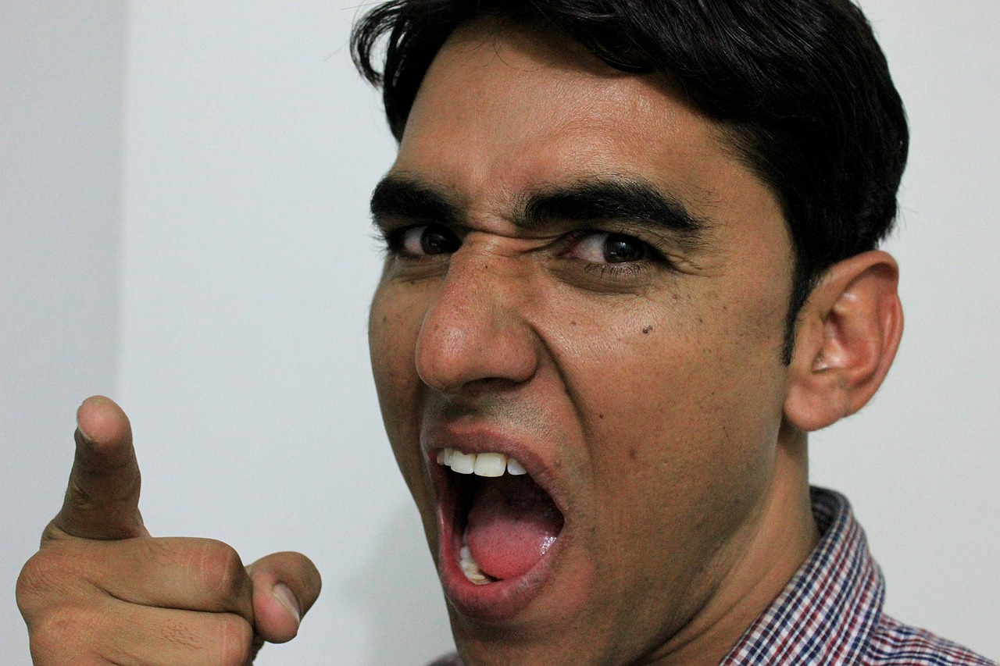
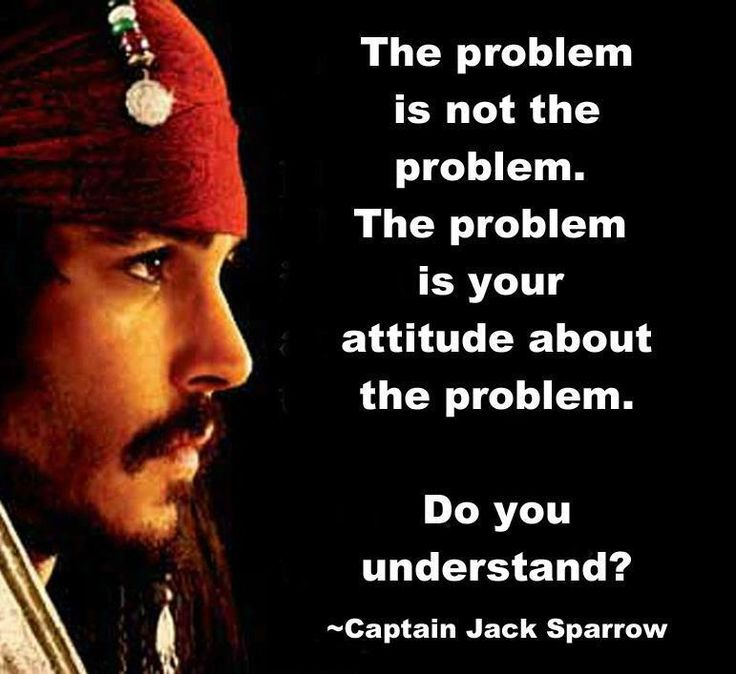
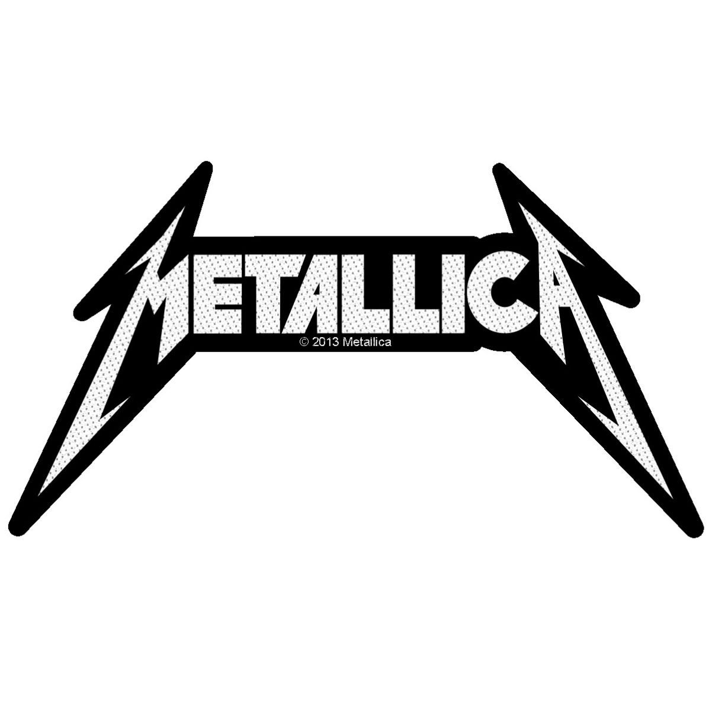
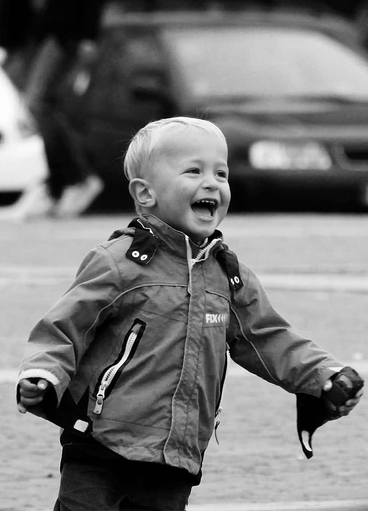
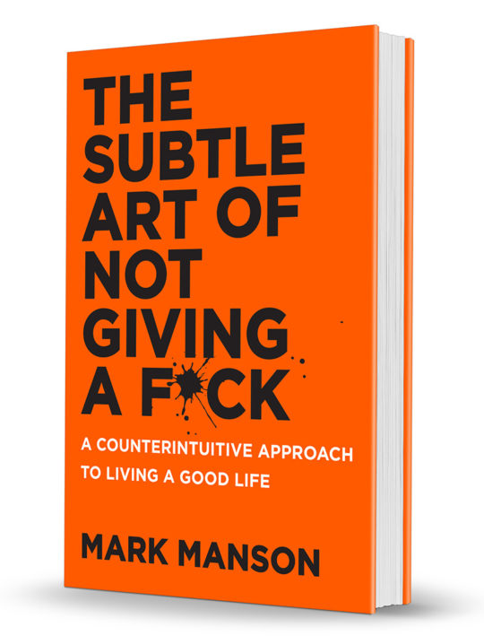

# Working as a Team

---

> "None of us is as good as all of us."
>
> — Ray Kroc

---

# Trust

---

# 70% Rule

^ Premature Optimization

---

> "It's not how I would have done it."

---

# Fault vs Responsibility

---

> "That's his code."  
>
> "She was supposed to do that."

---

---

^ Megadeath story

^ Fired from the band and sent home 2 days before recording the first album.

^Distraught but on the way to Los Angeles decided to show everyone.  

^ Dedicated himself to forming a new band, and being so good and successful that the old band would regret what they did to him.

---

---

^ 50 million albums.

^ One of the most influential heavy metal bands.

^ Toured the world.

^ He gave an interview and said he was miserable, felt like a failure?  Why?

---

^ Sold over 180 million albums.

^ One of the most influential bands in rock music.

---

# Happiness

---

> "Happiness comes from solving problems."

---

> "True happiness occurs only when you find the problems you enjoy having and enjoy solving."

---

>  "If you want to change how you see your problems, you have to change what you value and/or how you measure failure/success."

