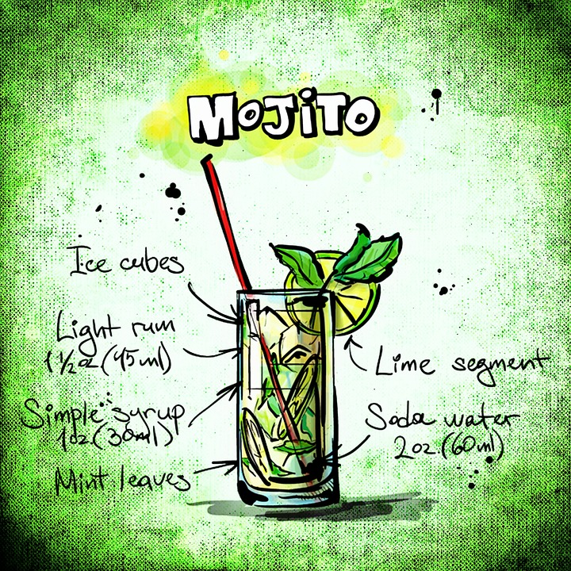
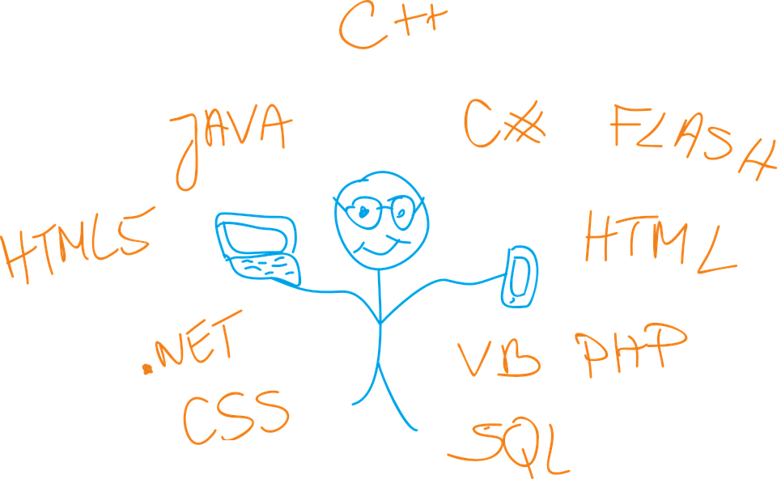
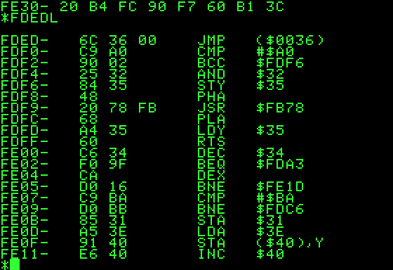
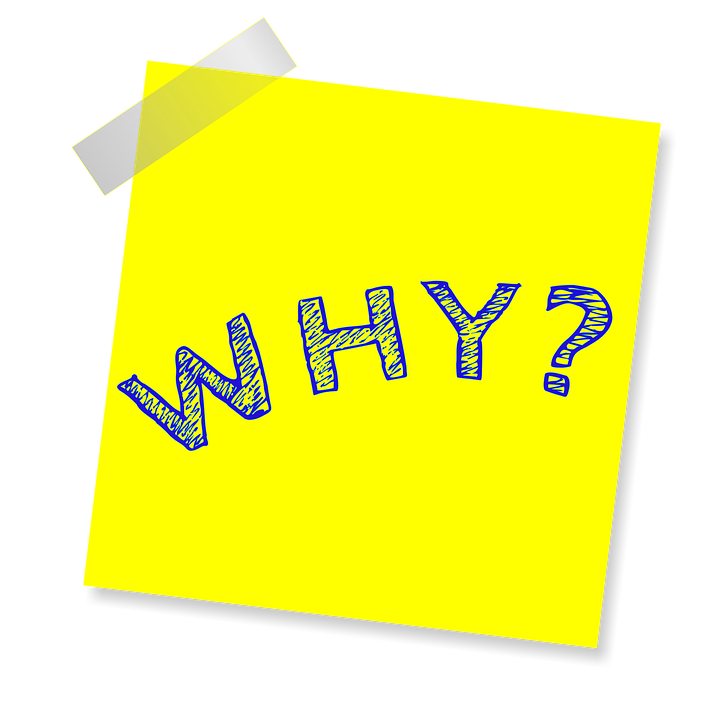
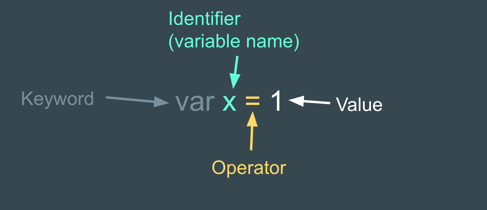

#[fit]Intro to 
#[fit]**Programming**

---


# Objectives

- Explain what programming is.
- Create a algorithm. 
- Use correct and specific language to describe code.
- Identify Expressions

---

# What is programming?

^Group up and write your definition.

---



#[fit]Algorithms

^An algorithm is a process used to solve a specific problem. It's just like a recipe - a small set of instructions in a language that takes some ingredients and does something with them to produce something delicious.

---


^Flowchart symbols.  Describe them.

^Group Task: Whiteboards - Create a algorithm to describe a task of your choosing.

---



# Programming Language

^A programming language is, as the name would suggest, a language developed to express programs.

---

#Machine Code



^All computers have a native programming language that they understand, commonly referred to as machine code. 

---


^Difficult to follow.

^Typically expressed in binary.

^Unique to a particular architecture.

^Two different computers could use two different versions of machine code.

---

#Programming Language


^Provide a better interface between us, as the programmers, and the computer.

^Allows programs to be expressed in a language easier to understand.

^Potentially common to a number of architectures.

^Can be translated into machine code.

^For this to happen a computer must either compile or interpret the program so it can be executed.

---


^A compiled program has to be modified into machine code before it is used. 

^An interpreted program is stored in a human-readable form. When the program is executed, an interpreter modifies the human-readable content as it is run.


^Source code to machine code image

---


#Speaking 
#like 
#a developer

---



^Collaborating on code with other developers.

^Interpreting error messages.

^They tend to be incredibly specific.

^Understanding documentation.

^Performing well in technical interviews.

^Speaking with confidence.

---

#Declaration

```javascript
var x;
```

---

#Assignment

```javascript
var x = 1;
```

^This is Declaring and Assignment combined.
^You might hear the term “set” instead of assign.

---

#Declaration/Assignment

The previous example showed them together … but they can (and are commonly)
placed on different lines.

```javascript
var x;
x = 1;
```

---



---

#Identifiers

###Used in
- Variable Names.
- Function Names.
- Parameter Names.

###Rules
- Must Start with a letter, _ or $.
- The rest may be letters, numbers, _ or $.

---

#Keywords

- Reserved
- if / function / var / while / this (and more)

```javascript
var pi = 3.14
```

---

#Operators

- They act like functions
- Different Syntax

```javascript
var five = 2 + 2 
```

---

#Literals

- Literally represents the data.
- Shorthand - extremely common.

```javascript
var greeting = "Hello g[32]";
```

---

#Expressions / Statements

- Expression
 - Something that results in a value.
 - someVar
 - 1 + 1
- Statement
 - A block of code that does something
 - If (x === y) …
 - x = 7; 


---

#Statement or Expression

```javascript
var x = 1 + 1 
```

---

#Statement or Expression

```javascript
var x = 1 + 1 
```

#Trick question ... both

^The entire thing is a statement.

^The 1+1 bit is an expression.

^Whiteboard Write one expression and one statement.

---


#Evaluation

##The order in which Javascript does things.

^The process of determining the value of an expression

^“Running the code” …

^Reducing expressions to their values.

^Determined by precedence

^Show mdn javascript precedence 

^https://developer.mozilla.org/en-US/docs/Web/JavaScript/Reference/Operators/Operator_Precedence

---

```javascript
var a = 5;
var b = 10;

function sum(a,b) {
  return a + b;
}

if (sum(a,b) > 9) {
  console.log('Greater than 9');
} else {
  console.log('Less than 9');
}
```


---

Source Code to Machine Code. Digital image. Compiling. Skillcrush, n.d. Web. http://skillcrush.com/2012/06/13/compiling/.

All other images from pixabay.com licensed under a CC-0 license.