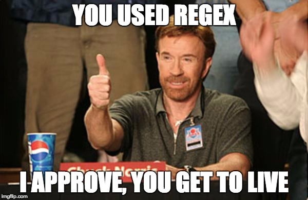

theme: Next, 1
autoscale: true
slidenumbers: true
<!-- @author: Pete Silva -->
<!-- @author: Craig Quincy -->


## RegEx
### Regular Expressions
### aka Wranglin' Strings

---

## Objectives
- Be able to use character classes, quantifiers, ranges, pattern modifiers, and special characters to build regex patterns to match strings
- Be able to identify situations in which regex provides advantages over traditional string matching or string manipulation

---

## Talk & Turn
If you had to find all the assets and links that start with http or https on the home page of www.galvanize.com, how would you do that with what you currently know?

---

## Regexes are the Chuck Norris of string matching



---

## Common applications include:

- Data validation
- Data scraping (especially web scraping)
- Data wrangling
- Simple parsing
- Syntax highlighting systems
- and much more!

---

## Characters have meaning

```markdown
^(([0-9]|[1-9][0-9]|1[0-9]{2}|2[0-4][0-9]|25[0-5])\.){3}([0-9]|[1-9][0-9]|1[0-9]{2}|2[0-4][0-9]|25[0-5])$
```

A regex string might look like gibberish, but every character has meaning! Sometimes the character has literal meaning, other times a character indicates some special meaning, like a "meta" character or some semantic grouping.

---

## RegEx Generally vs JS

JS lets you define a regex pattern as a literal between / and optionally followed by a modifier (i, g, m).

```javascript
var oldStr = "Mr Blue has a blue house and a blue car";
var newStr = oldStr.replace(/blue/g, "rainbow");
// "Mr Blue has a rainbow house and a rainbow car"
```

---

## Modifiers
- **i** - case insensitive match (matches either A or a)
- **g** - global match (find all matches, not just first one)
- **m** - multiline match (matches across newlines \n)

In a JS regex, these come after the trailing /

```javascript
str.match(/pattern/g)
```

---

## Metacharacters
Symbols that represent single characters of a certain type. [RexEgg Cheatsheet](http://www.rexegg.com/regex-quickstart.html)

|Symbol|Represents|
|---|---|
|**.**|Any single character, except newline|
|**\d**|A single digit|
|**\w**|A single alphanumeric or _|
|**\s**|A single space|

---

## Quantifiers
How many times to match the preceding symbol (or grouping)

|Symbol|Represents|
|---|---|
|**?**|Zero or one|
|*|Zero or more|
|**+**|One or more|
|**{3}**|Exactly 3|

---

## Greedy vs Lazy Quantifiers
Quantifiers are greedy by default. Tack on ? to make lazy.

- **Greedy**: Match longest possible string.
- **Lazy**: Match shortest possible string.

```javascript
myStr = "Round green triangles sleep furiously in green pajamas."
myStr.match(/(.*?)green/)
// Only selects "round green" rather than up to the last "green"
```

---

## Anchors/Boundaries
Represents the start or end of a string/line, or word boundaries


## ^, $, and \b

---

## Character Classes [Brackets]
Lets you specify a range or set of possible characters for one character in your string

## [a-z], [AEIOU], [^\d]

---

## Logic

|Symbol|Represents|
|---|---|
|pipe|OR operator between symbols/groupings|
|()|Numbered capture group|
|\1|Contents of capture group 1|

---

## Whitespace
Single space, tab, new line

## \s, \t, \n, \r\n

---

## Links for Much Win + Great Success

[http://www.rexegg.com/regex-quickstart.html](http://www.rexegg.com/regex-quickstart.html)
[https://www.w3schools.com/jsref/jsref_obj_regexp.asp](https://www.w3schools.com/jsref/jsref_obj_regexp.asp)
[http://www.regextester.com](http://www.regextester.com)
[http://www.regextester.com/1985](http://www.regextester.com/1985)
[https://regexone.com](https://regexone.com)
[https://regex101.com/](https://regex101.com/)

---

## We do
Let's pull all HTTP or HTTPS references out of an HTML file, resulting in a list of links.
