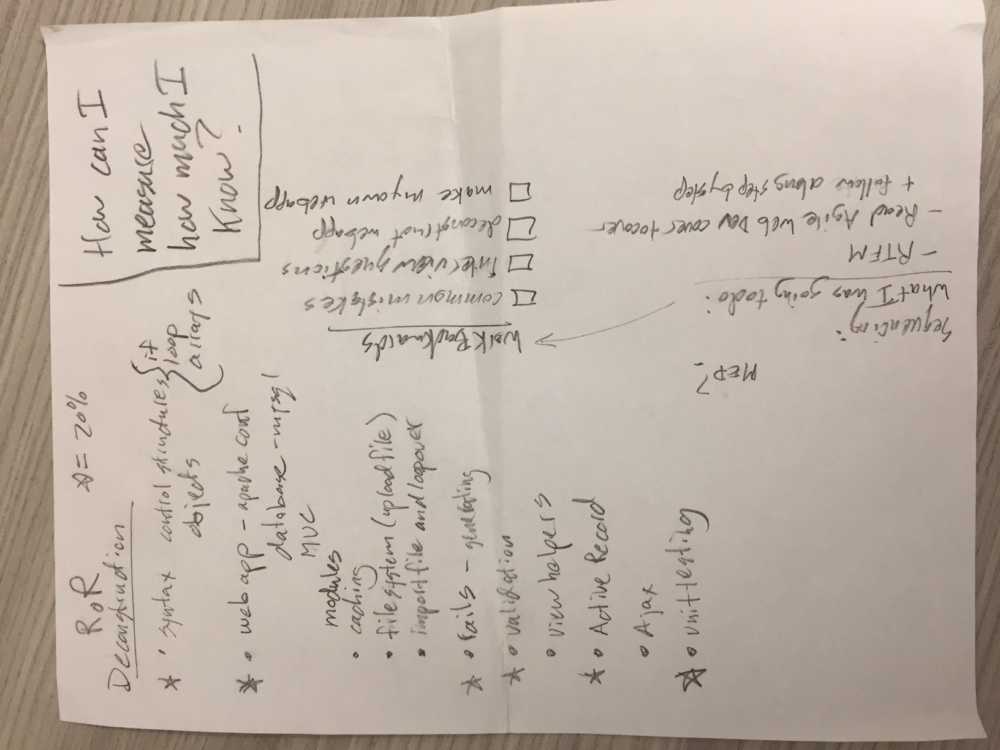

# Ruby on Rails

---

## Objectives:

- Define what MVC stands for
- Compare MVC implementation between RoR and Node/Express
- Build a CRUD app in Rails in less than 3 hours

---

# Research with Partner (2 min) what is an MVC?

---

# MVC


---

# I DO ... build Q2 assesment app

---

```
git clone https://github.com/craigquincy/rails_messages.git
```

---

## With a partner clone the messages app and answer the following questions. (10 min)

- What is the equivalent to package.json?
- Where is the database connection info defined?
- Where are migrations and seeds defined?
- What is the equivalent of the routes file node/express?  Hint: look in /app/controllers directory
- Where are models defined?
- Is there an equivalent to app.js or server.js?

---

## With a partner, determine Pros/Cons of using Ruby on Rails vs. A Node/Express for a web application. (5 min)

---

## My plan for learning RoR from 2012



---

## CFU

- What the MVC pattern?
- What does the Gemfile in Rails do?
- What does an ActiveRecord model in Rails do?
- What are some advantages/disadvantages of using RoR for a large scale application?
- What are some advantages/disadvantages of using RoR for a Proof of Concept?


