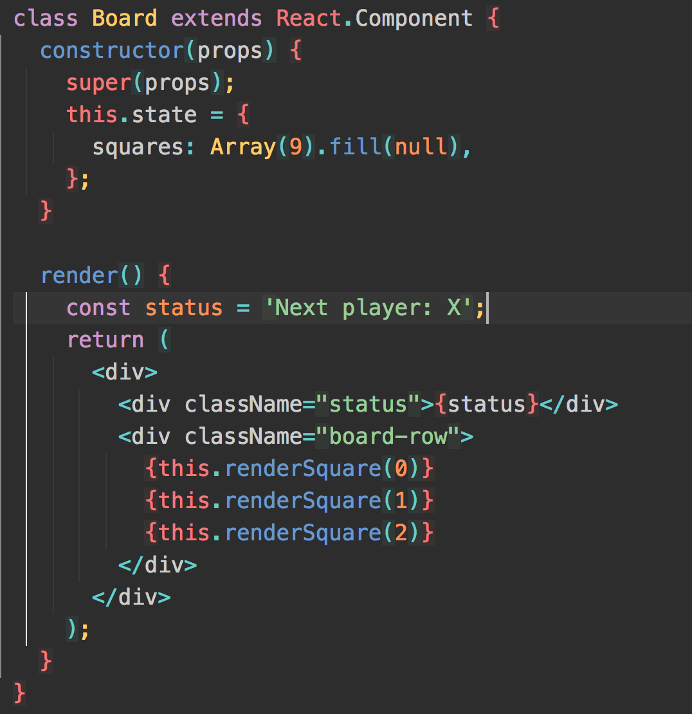

# Intro to React

---

## Objectives

- Describe what React is
- Understand what Webpack And Babel are doing
- Describe Web Components and how they are rendered via the Virtual DOM
- Understand what state is

---

# React Concepts

- Web Components
- 1 way data binding
- Virtual DOM
- JSX (which requires a "build" step)
- State management (Flux or Redux)

^React is a declarative, efficient, and flexible JavaScript library for building user interfaces.

---

# Getting Started

+ Package Manager (NPM, Yarn, Bower)
+ Module Bundler (Webpack, Browserify)
+ Transpiler(Babel)
+ Task Runner (Gulp, Grunt)

^ Javascript was originally designed to only run in the browser. So having access to a computer's filesystem was an impossibility. 

^ This means loading your files globally, like in our script tags, cans and such.

^ In 2009 a project (CommonJS) was started to create an ecosystem for JS outside the browser. Node came out of this project. This gave you the ability to import and export code across files

^ This is all great for node.js, but if you tried to use the above code in the browser, you’d get an error saying require is not defined. The browser doesn’t have access to the file system, which means loading modules in this way is very tricky — loading files has to be done dynamically, either synchronously (which slows down execution) or asynchronously (which can have timing issues).

^ JavaScript module bundler is a tool that gets around the problem with a build step (which has access to the file system) to create a final output that is browser compatible (which doesn’t need access to the file system). In this case, we need a module bundler to find all require statements (which is invalid browser JavaScript syntax) and replace them with the actual contents of each required file. The final result is a single bundled JavaScript file (with no require statements)!

---

# Components

^Your components tell React what you want to render – then React will efficiently update and render just the right components when your data changes.

---

# What are Props?

+ Customize components with parameters = props
+ Can use destructuring to get prop name off props

^A component takes in parameters, called props, and returns a hierarchy of views to display via the render method.

---

# JSX

^The render method returns a description of what you want to render, and then React takes that description and renders it to the screen. In particular, render returns a React element, which is a lightweight description of what to render. Most React developers use a special syntax called JSX which makes it easier to write these structures.

---

# Virtual DOM

---

# Understanding State

+ constructor
+ state
+ setState()
+ render 

^ When creating a component you are creating this skeletal system for what it looks like, a framework

^ The dynamic features of this component is set within state. 

^ State is held within a constructor, which holds state privately within that component.

^ You need to explicitly call super()

^ props are passed down through here. 

^ to change state you will call the setState() function

^There are generally two ways for changing data. The first method is to mutate the data by directly changing the values of a variable. The second method is to replace the data with a new copy of the object that also includes desired changes.

^ Easier Undo/Redo and Time Travel - easy to switch between references in data mutations

^ Tracking Changes - Determining how an immutable object has changed is considerably easier. If the object being referenced is different from before, then the object has changed. That’s it.

^ Determining When to Re-render in React

---

## Objectives

- Describe what React is
- Understand what Webpack And Babel are doing
- Describe Web Components and how they are rendered via the Virtual DOM
- Understand what state is
