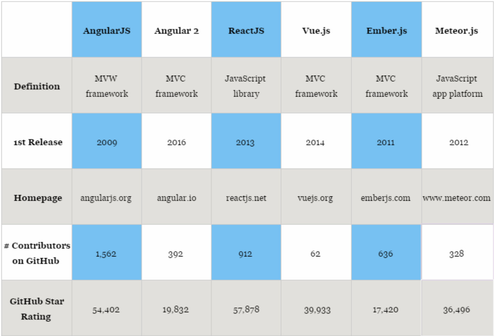
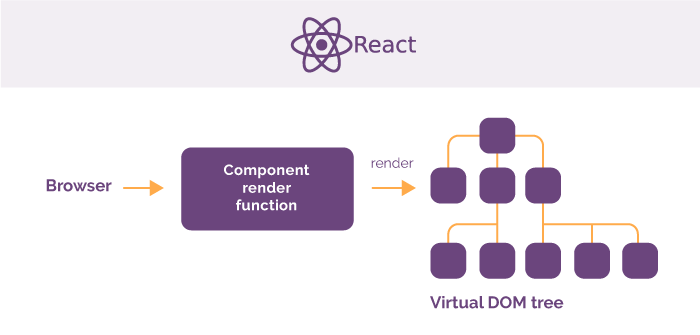
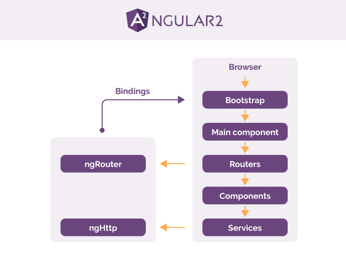

# Front End Frameworks Intro
## ... and not really an intro to React

---
# Objectives
- Describe the concept of a Single Page App (SPA)
- Describe the advantages of using a Front End Frame work
- Name the key concepts in ReactJS

---

# Rise of the SPA

In a single-page application, all of the code needed is included in a single-page load. This includes all of the CSS, HTML, and JavaScript. The page does not reload, and it requires dynamic interaction with the Web server.

---

Front End Frameworks help to build SPAs.

---

# Advantages

1. Efficiency — projects that used to take months and hundreds of lines of code now can be achieved much faster with well-structured prebuilt patterns and functions.

---

2. Safety — top javascript frameworks have firm security arrangements and are supported by large communities where members and users also act as testers.

---

3. Cost — most frameworks are open source and free. Since they help programmers to build custom solutions __faster__, the ultimate price for web app will be lower.

---

# Most Popular Frameworks in 2017 (in order of popularity)

- ReactJs
- Angular
- Vue (sort of)
- Others...Ember, Meteor, Backbone

---

Question: Why is React listed as a Library?

---

# React Concepts

- Web Components
- 1 way data binding
- Virtual DOM
- JSX (which requires a "build" step)
- State management (Flux or Redux)

---

# React in a Nut Shell

---

# Angular in a Nut Shell

---

## Question: How are React & Angular similar/different?

---

# CFU

- Describe the concept of a Single Page App (SPA)
- Describe the advantages of using a Front End Frame work
- Name the key concepts in React

----

# Resources
- https://rubygarage.org/blog/best-javascript-frameworks-for-front-end
- https://blog.appdynamics.com/product/comparing-the-4-most-popular-client-side-javascript-frameworks/
- https://hackernoon.com/5-best-javascript-frameworks-in-2017-7a63b3870282
- https://medium.com/javascript-scene/top-javascript-frameworks-topics-to-learn-in-2017-700a397b711

