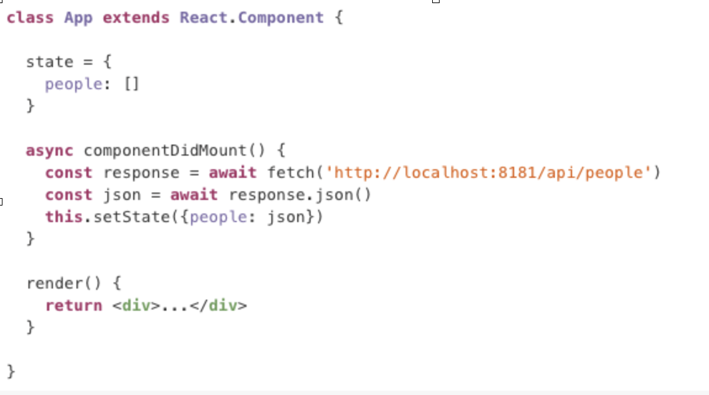
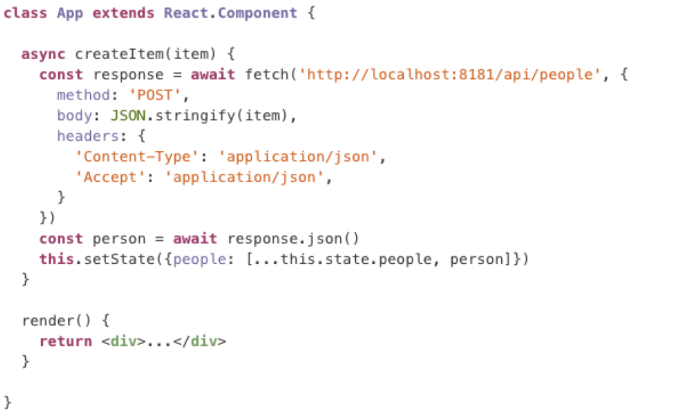

## Integrating React with APIs

---

# Objectives

+ Connect a React App with an API
+ Name the steps to make a GET request and update state in a React.Component
+ Name the steps to make a POST request and update state in a React.Component

---

# Steps to populate state based on an API

1. define initial state in a class property  ```this.state = { people: [] } ```
1. define an async componentDidMount method
1. fetch the data and await the response (inside componentDidMount)
1. turn it into json and await the response
1. this.setState
1. render the state info in the component

---



# Fetch Data Example

+ define an async method on your component
+ fetch the data and await the response
+ turn it into json and await the response
+ call setState()


---

# Steps for handling a POST request in a React.Component

1. Define an async method that takes the data as a parameter. Note an event handler needs to use this method after it gets information out of the DOM (such as a form)
1. use fetch to do the POST request
1. get the added data from the json
1. use this.setState() to update state with the new item

---

# Post



---

#Objectives

+ Connect a React App with an API


