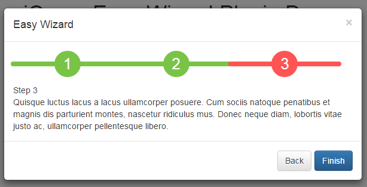
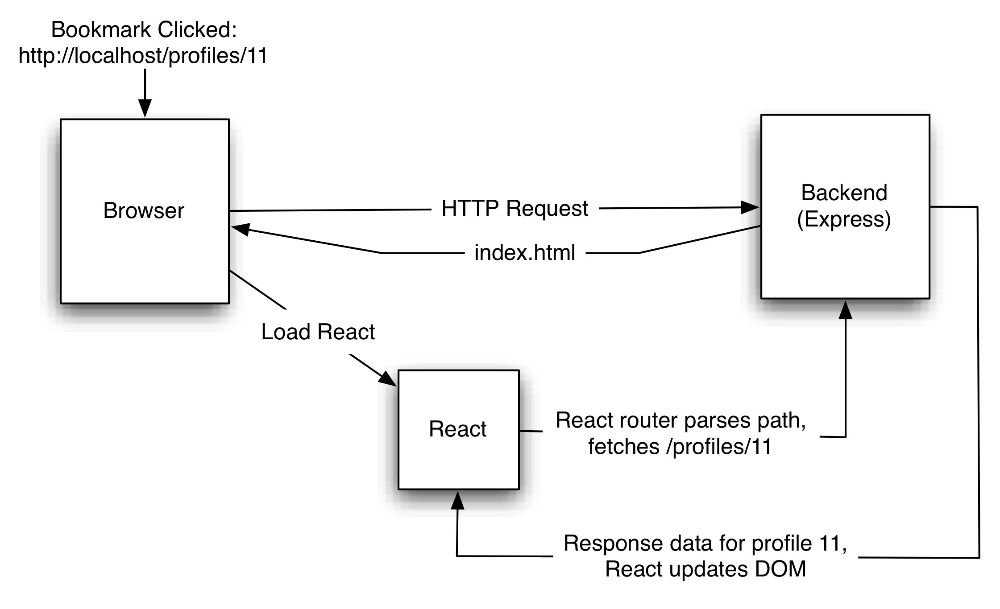

theme: Titillium, 1
autoscale: true
slidenumbers: true
<!-- @author: Pete Silva -->


# React Router

---


## Objectives

- Explain what client-side routing does for us
- Name the 2 major things frontend frameworks do for us
- Be able to write a basic route

---


### __Client side routing: what is it?__

[https://medium.com/@wilbo/server-side-vs-client-side-routing-71d710e9227f](https://medium.com/@wilbo/server-side-vs-client-side-routing-71d710e9227f)

Quick research

---


Frontend frameworks can be thought of as doing 2 things:

- __Manage the DOM__
  - (fetching, modifying, tracking state)
- __Manage URL path bar__
  - (history, modifying, routing)

---


2 ways data can load into our components:

- Upon page load
- Upon events/actions (button clicks, fetch calls)

How much do you want to load up front vs later fetch (ajax) calls?

If we load most data later via component fetches, and we reload the browser then what? How to get back to where we were? React Router's got work to do

---


In a world...
with no page loads between view changes, what should the back button do?


---

Could trigger a different view of sorts?
Maybe just a few components should be hidden/displayed/modified?



---
/Bookmarks-56d0cca45f9b5879cc7123a4.jpg)

How do bookmarks work? What happens when a user clicks a bookmarked URL?

`http://getthatcheddah.gov.orgcom/application/step/3`

Either gets all data for that view up front from the server or has to "rebuild" that view in a sense, through subsequent fetches. React can handle a lot of this for you.

---


---
__History API__

JS can manipulate the address in the URL bar WITHOUT actually making an HTTP request to the server

```js
// plain 'ol JS
history.pushState({}, 'Hello', '/my/new/path')

// react
history.push('/about')
history.push('/about', { some: 'state' })
history.goBack()
```
[https://reacttraining.com/react-router/web/api/history](https://reacttraining.com/react-router/web/api/history)

---


#### Update URL w/ 2 types: __hash path__ or the __path (no hash)__

`http://localhost/#/my/fake/path`

- A "client-side only" path, will not trigger HTTP request. HTTP Servers usually ignore anything after #, returning same response specified by URL up to the #.

`http://localhost/my/full/path`

- If using a normal path, server must know to respond with index.html despite the given path. React router then processes the path, fetching/DOMing as necessary

---


### __Hash:__ no server involved
### __No hash:__ server has to send the index.html, despite path

---


__react-router__ vs
__react-router-dom__ vs
__react-router-native__

[https://medium.com/@pshrmn/a-simple-react-router-v4-tutorial-7f23ff27adf](https://medium.com/@pshrmn/a-simple-react-router-v4-tutorial-7f23ff27adf)

---

```jsx
import React from 'react'
import { BrowserRouter as Router, Route, Link } from 'react-router-dom'
const ParamsExample = () => (
  <Router>
      <ul>
        <li><Link to="/netflix">Netflix</Link></li>
        <li><Link to="/yahoo">Yahoo</Link></li>
      </ul>
      <Route path="/:id" component={Child}/>
  </Router>
)
const Child = ({ match }) => (
    <h3>ID: {match.params.id}</h3>
)
export default ParamsExample
```

---
### Path Params (into component)

```jsx
// if path matches, display component
<Route path="/foo/:thing1/:thing2" component={MyComponent} />

const MyComponent = ({match}) => (
  <div>
    {match.params.thing1}
    {match.params.thing2}
  </div>
)
```

---
### Route examples

```jsx
<Route path="/about" component={About} />
```

or

```jsx
<Route path="/about" render={() => (
  <h1>Render About here!</h1>
)} />
```

---


### Demo

```
create-react-app routerdemo
cd routerdemo
yarn add react-router-dom
atom .
yarn start
```

---


## Objectives

- Explain what client-side routing does for us
- Name the 2 major things frontend frameworks do for us
- Be able to write a basic route
