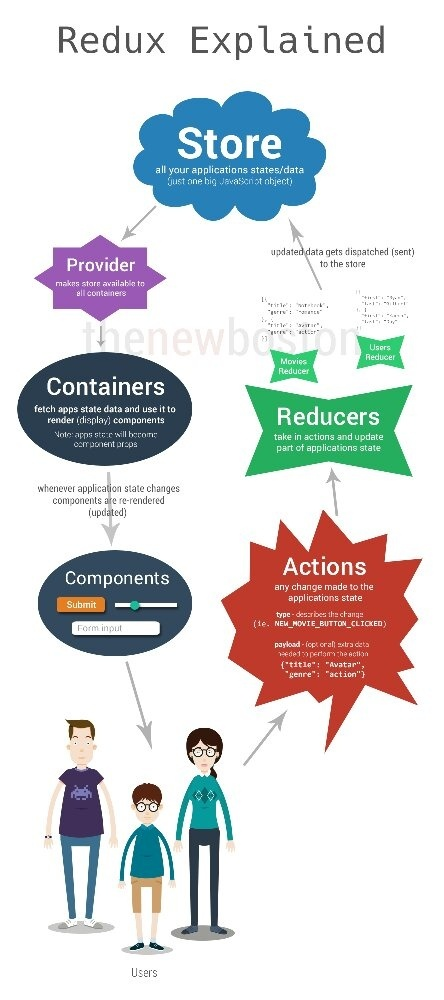

^ React - Library for a Single Page Application

^ Compnent - Each component has state

^ Problem - Single Page Application - lots of components - lots of states

^ After that - figure out how things are connected

^ Easy way to set it up.

---

# Objectives

- Understand why one would use Redux
- Explain Redux basics such as actions, reducers, and store
- Differentiate between plain redux and using the react-redux library

---

# 3 principles:

1. State is tracked in a single Javascript object
2. State is READONLY. Actions manipulate state, actions have a state
3. A pure function, called "the Reducer", calculates the next state tree based on the previous state tree and the action being dispatched.

---

# Why Redux?

This complexity is difficult to handle as we're mixing two concepts that are very hard for the human mind to reason about: **mutation** and **asynchronicity**

Also skim this on [why react / redux](https://jrsinclair.com/articles/2018/react-redux-javascript-architecture/ ) (from casidoo's newsletter) it is about separating state from dom and the problems with lifting state to top. Passing everything from top is a little crufty.

---

# Things to notice with Redux

const store = createStore(reducer)

Vanilla react = store.subscribe() & store.dispatch()

---

# What is the "shape" of our state?

From reducers/todos.js

`const todos = (state = [], action)`

---

# It's called README for a reason

Go over [counter example](https://redux.js.org/#the-gist) together

---

---

### *buckyroberts/React-Redux-Boilerplate*. (2017). *GitHub*. Retrieved 18 July 2017, from https://github.com/buckyroberts/React-Redux-Boilerplate

---

# Usage With React & Todos Example

In Redux docs, focus on "Usage With React" section! Trust me.

[Usage With React](https://redux.js.org/docs/basics/UsageWithReact.html)
[Todos Example](https://github.com/reactjs/redux/tree/master/examples/todos)

---

# Using react-redux

Provider (react-redux) takes store

Connect (react-redux) is alternative to avoid writing store.subscribe() and store.dispatch() by hand and unnecessary renders

---

# More on connect (react-redux)

To use connect, you need to define a special function called mapStateToProps() instead of using store.subscribe()

mapDispatchToProps() receives the store.dispatch() method and returns callback props that you want to inject into the presentational component

---

# "Dumb" Components vs Containers

Components tend to be “dumb” and not use connect.
Containers tend to use connect and dispatch, but not always black and white.

---

# Objectives

- Understand why one would use Redux
- Explain Redux basics such as actions, reducers, and store
- Differentiate between plain redux and using the react-redux library
