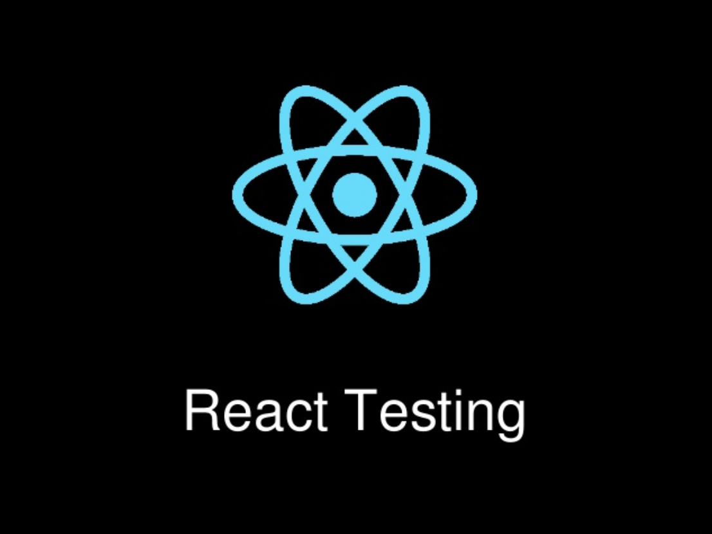

---

# Objectives:
- What are the three TDD principles that corresond to Red-Green-Refactor
- Explain how to code when using TDD Red-Green-Refactor
- Explain how the Testing Pyramids guides the types of tests to write
- Define common types of Unit and Integration tests
- Write Tests for React

---

### Research Questions: (10 min)
- What are the principles of TDD?
- What does RED - GREEN - REFACTOR mean?
- What are End to End, Integration and Unit Tests?
- What is the Testing Pyramid and how does it help you determine the types of tests to create?
- What does it mean to mock the Redux store or fetch?
- What does jest.fn do when it "spies" on code during a test
- What is enzyme?

---

---

---

# Types of Tests

## Guiding Questions:
- What type of test is it? (E2E, Integration, Unit)
- What does it actually verify in the application?

---

# Types of Tests

- Smoke Tests
- Snapshot Tests
- Shallow Tests
- Mount Tests
- Testing a Reducer
- Testing Action Creators

---

# Coding React Tests

https://github.com/gSchool/react-jokes-demo

---

## I Do
- Smoke Test <App /> renders without throwing errors, mock the store and fetch

---

## We Do
- Shallow Test that clicking button in <AddJoke /> calls supplied handler

---

## You Do
- Determine and create appropriate create tests for <Jokes /> Component

---

# Resources

- [Testing Components](https://github.com/facebook/create-react-app/blob/master/packages/react-scripts/template/README.md#testing-components)
- [TDD](https://marcabraham.com/2012/04/03/what-are-the-key-principles-of-test-driven-development/)
