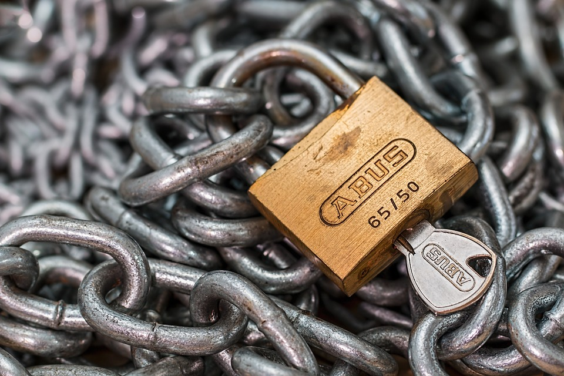
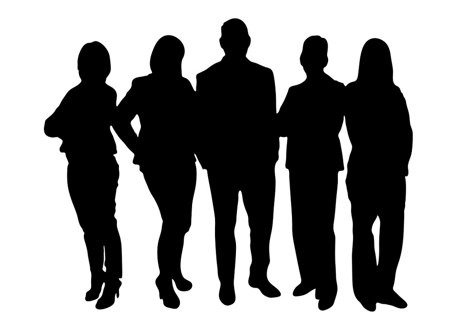

#[fit] Social
#[fit] Engineering

---

# What is the biggest security risk?

---

#[fit] You Are

---

#[fit]Social Engineering
#[fit]is the art of manipulating
#[fit]people so they give up
#[fit]confidential information.

---

## Social Engineering exploits cognitive biases

---

### Cognitive biases are tendencies to think in certain ways that can lead to systematic deviations from a standard of rationality or good judgment.

---

# Pretexting

^Pretexting is a form of social engineering in which an individual lies to obtain privileged data.

^A pretext is a false motive.

---

# Phishing

^ Someone sending an email pretending to be a legitimate business.

^ IVR or phone phishing.

^ Spear phishing

---

# Baiting

^Baiting is like the real-world Trojan Horse that uses physical media and relies on the curiosity or greed of the victim.

^In this attack, the attacker leaves a malware infected floppy disk, CD-ROM, or USB flash drive in a location sure to be found (bathroom, elevator, sidewalk, parking lot), gives it a legitimate looking and curiosity-piquing label, and simply waits for the victim to use the device.

---

#Quid pro quo

^An attacker calls random numbers at a company, claiming to be calling back from technical support. Eventually this person will hit someone with a legitimate problem, grateful that someone is calling back to help them. The attacker will "help" solve the problem and, in the process, have the user type commands that give the attacker access or launch malware.

---

# Tailgating

---

