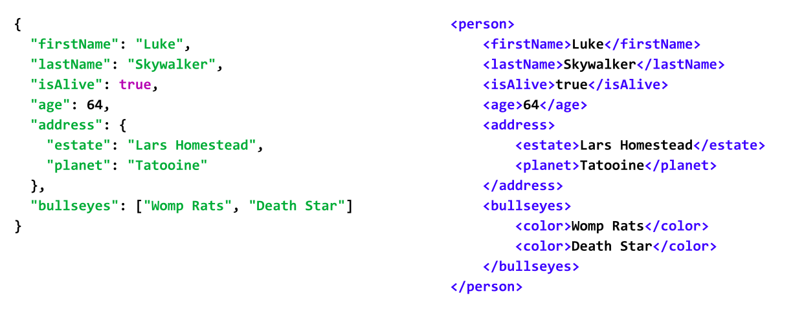
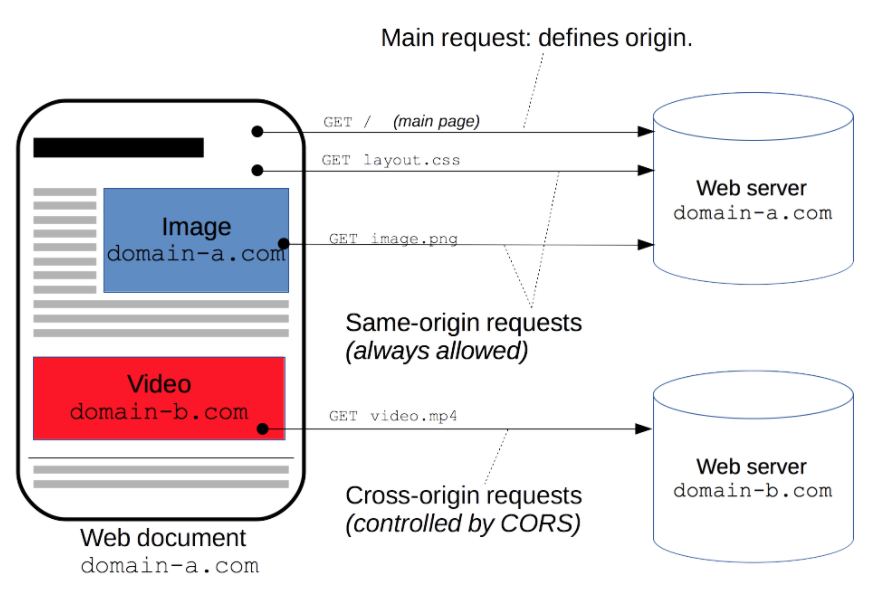
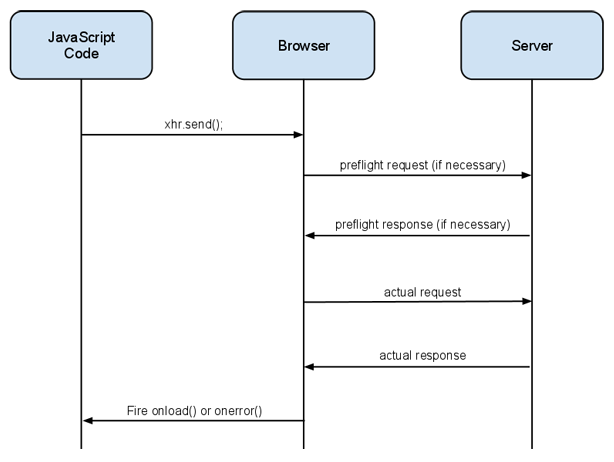

# [fit] HTTP & Ajax

---
## Objectives

1. Explain what Ajax is.
1. Explain why Ajax primarily transfers JSON data now.
1. Use Ajax to retrieve data from a server.
1. Handle CORS issues caused by Ajax requests.
1. Handle race conditions caused by Ajax requests.

---
# 1. Explain what Ajax is.
---

## What is Ajax?
A set of techniques used to send data to and retrieve data from a server asynchronously

---

## What technologies does Ajax comprise?

- HTML and CSS for presentation
- The DOM for dynamic display of and interaction with data
- JSON or XML for the interchange of data
- The XMLHttpRequest object for asynchronous communication
- JavaScript to bring these technologies together

---
## Why use Ajax?
To exchange data with a server without blocking the other functionality of our app: asynchronous requests 

---
## No one likes to wait in line


---

## Two use cases for Ajax:
- using Ajax while pages are loading
- using Ajax when pages have loaded

---
## Where are we sending these requests?
- To an Application Programming Interface (API)
- A set of functions that are exposed on an application in order for other applications to interact with it
- The interface that you send your HTTP requests to 

---
# 2. Explain why Ajax primarily transfers JSON data now.

---

> XML is nasty to parse for humans, and it's **a disaster to parse even for computers.** There's just no reason for that horrible crap to exist.
-- Linus Torvalds

---


---
# 3. Use Ajax to retrieve data from a server.
---

## XMLHttpRequest
- Introduced in 2002
    - Revolutionized the web
    - Websites could be dynamic for the first time
- Used to make requests to other servers without navigating away from the current webpage. 

---
```
var xhr = new XMLHttpRequest();

xhr.addEventListener('load', function() {
    if (xhr.status !== 200) {
        return;
    }

    var data = JSON.parse(xhr.responseText);

    console.log(data);
});

xhr.open('GET', 'https://www.omdbapi.com/?t=Gods and Monsters');

xhr.send();
```

---
### Create an XHR object
```
// Create a new XMLHttpRequest object to start
var xhr = new XMLHttpRequest();

xhr.addEventListener('load', function() {
    if (xhr.status !== 200) {
        return;
    }
    
    var data = JSON.parse(xhr.responseText);

    console.log(data);
});

xhr.open('GET', 'https://www.omdbapi.com/?t=Gods and Monsters');

xhr.send();
```

---
### Define what happens when the data from the API loads
```
var xhr = new XMLHttpRequest();

// Create a function that is called when the request status has changed
xhr.addEventListener('load', function() {
    if (xhr.status !== 200) {
        return;
    }
    
    var data = JSON.parse(xhr.responseText);

    console.log(data);
});

xhr.open('GET', 'https://www.omdbapi.com/?t=Gods and Monsters');

xhr.send();
```

---
### Tell It Where to Go and How
```
var xhr = new XMLHttpRequest();

xhr.addEventListener('load', function() {
    if (xhr.status !== 200) {
        return;
    }
    
    var data = JSON.parse(xhr.responseText);

    console.log(data);
});

// Tell the XMLHttpRequest where you want it to go and how
xhr.open('GET', 'https://www.omdbapi.com/?t=Gods and Monsters');

xhr.send();
```
---
### Send it off
```
var xhr = new XMLHttpRequest();

xhr.addEventListener('load', function() {
    if (xhr.status !== 200) {
        return;
    }
    
    var data = JSON.parse(xhr.responseText);

    console.log(data);
});

xhr.open('GET', 'https://www.omdbapi.com/?t=Gods and Monsters');

// Send it off!
xhr.send();
```
---
### Handle it When it Comes Back (async)
```
var xhr = new XMLHttpRequest();

xhr.addEventListener('load', function() {
	// If the request status is not 200, return;
	// console log the returned data
    if (xhr.status !== 200) {
        return;
    }
    
    var data = JSON.parse(xhr.responseText);

    console.log(data);
});

xhr.open('GET', 'https://www.omdbapi.com/?t=Gods and Monsters');

xhr.send();
```
---
```
// Create a new XMLHttpRequest object to start
var xhr = new XMLHttpRequest();

// Create a function that is called when the request status has changed
xhr.addEventListener('load', function() {

	// When the request status is anything other than 200, return out of the function
    if (xhr.status !== 200) {
        return;
    }
    
    var data = JSON.parse(xhr.responseText);

    console.log(data);
});

// Tell the XMLHttpRequest where you want it to go and how
xhr.open('GET', 'https://www.omdbapi.com/?t=Gods and Monsters');

// Send it off! 
xhr.send();
```
---
### There must be an easier way. jQuery?


---
## Using jQuery
```
var $xhr = $.getJSON('https://www.omdbapi.com/?t=Gods and Monsters');

$xhr.done(function(data) {
    if ($xhr.status !== 200) {
        return;
    }

    console.log(data);
});
```
---
## You can even use it to manipulate the DOM
```
$.get("http://www.reddit.com/r/aww.json", function(data) {
	var title = data.data.children[0].title;
	$(".result").append(‘<h1>’ + title + </h1>);
});
```
---
## The .ajax() method

```
$.ajax({
  url: "example.com/api",
  type: "get", 
  data:{"first": "Brendan, "last": "Haskins"},
  success: function(response) {
    //Do Something
  },
  error: function(xhr) {
    //Do Something to handle error
  }
});
```

---
# 4. Handle CORS issues caused by Ajax requests.
---
## Same Origin Policy (SOP)
- The Same Origin Policy permits scripts contained in a first web page to access data in a second web page, but only if both web pages have the same origin. 
- An origin is defined as a combination of URI scheme, hostname, and port number. 
- This policy prevents a malicious script on one page from obtaining access to sensitive data on another web page through that page's DOM.

---
## The SOP can pose a problem
Certain "cross-domain" requests, notably AJAX requests, however are forbidden by default by the same-origin security policy.

---
## CORS Restriction example
```
XMLHttpRequest cannot load http://example.com/. 
No 'Access-Control-Allow-Origin' header is present 
on the requested resource. Origin 'http://example.net/'
is therefore not allowed access.
```
---


---
## Cross-Origin Resource Sharing

- A mechanism that allows restricted resources on a web page to be requested from another domain outside the domain from which the resource originated
- Extends HTTP with Origin request header and Access-Control-Allow-Origin response header

---
## Cross-Origin Resource Sharing
- Allows servers to use a header to explicitly list origins that may request a file or to use a wildcard and allow a file to be requested by any site
- Get around CORS restrictions with a proxy (a server, rather than a browser, that grabs and relays a request along)

---


---
# 5. Handle race conditions caused by Ajax requests.
---
```
console.log('BEFORE THE AJAX');

var $xhr = $.getJSON('https://www.omdbapi.com/?t=Gods and Monsters');

$xhr.done(function(data) {
    if ($xhr.status !== 200) {
        return;
    }

    console.log(data.Title);
});

console.log('AFTER THE AJAX');
```

---

# Review
1. Explain what Ajax is.
1. Explain why Ajax primarily transfers JSON data now.
1. Use Ajax to retrieve data from a server.
1. Handle CORS issues caused by Ajax requests.
1. Handle race conditions caused by Ajax requests.

---

